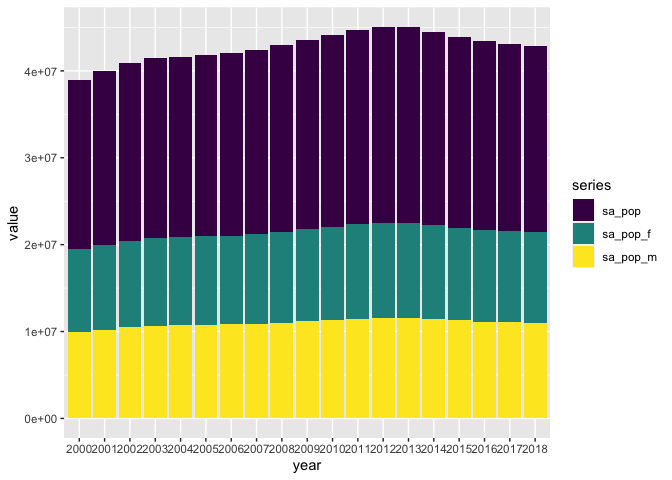
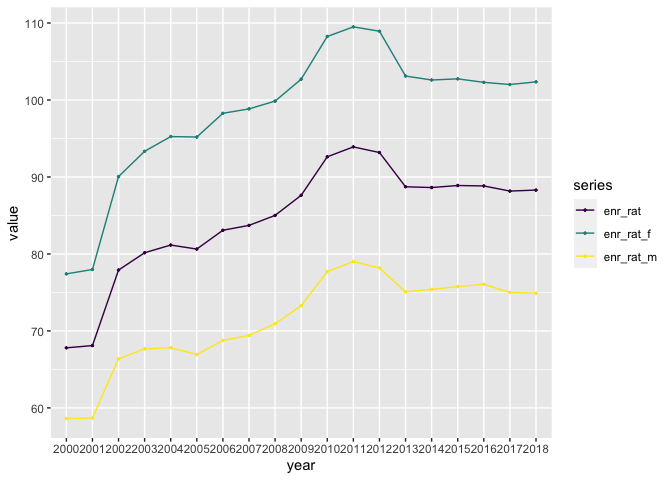
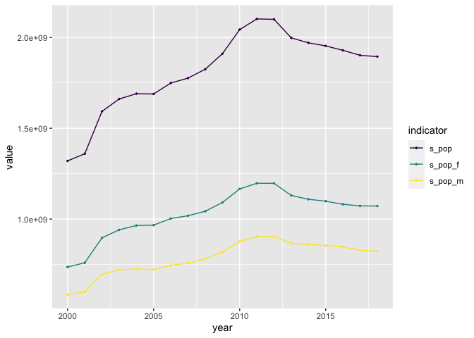

cleaning-script
================

## Package Loading

``` r
library(tidyverse)
```

    ## ── Attaching packages ─────────────────────────────────────── tidyverse 1.3.2 ──
    ## ✔ ggplot2 3.4.1      ✔ purrr   0.3.4 
    ## ✔ tibble  3.1.8      ✔ dplyr   1.0.10
    ## ✔ tidyr   1.2.1      ✔ stringr 1.4.1 
    ## ✔ readr   2.1.2      ✔ forcats 0.5.2 
    ## ── Conflicts ────────────────────────────────────────── tidyverse_conflicts() ──
    ## ✖ dplyr::filter() masks stats::filter()
    ## ✖ dplyr::lag()    masks stats::lag()

``` r
library(ggpubr)
```

## Data Loading

``` r
us_enrollment_data <- read.csv("/Users/kenjinchang/github/projected-impact-model/parent-datasets/us_enrollment_data.csv") %>%
  as_tibble()
us_enrollment_data
```

    ## # A tibble: 11 × 23
    ##    Country.Name   Count…¹ Series Serie…²  YR2000  YR2001  YR2002  YR2003  YR2004
    ##    <chr>          <chr>   <chr>  <chr>     <dbl>   <dbl>   <dbl>   <dbl>   <dbl>
    ##  1 "United State… "USA"   "Scho… "SP.TE…  1.95e7  2.00e7  2.04e7  2.07e7  2.08e7
    ##  2 "United State… "USA"   "Scho… "SP.TE…  9.51e6  9.74e6  9.96e6  1.01e7  1.01e7
    ##  3 "United State… "USA"   "Scho… "SP.TE…  9.96e6  1.02e7  1.05e7  1.06e7  1.07e7
    ##  4 "United State… "USA"   "Gros… "SE.TE…  6.78e1  6.81e1  7.79e1  8.02e1  8.12e1
    ##  5 "United State… "USA"   "Gros… "SE.TE…  7.74e1  7.80e1  9.01e1  9.33e1  9.53e1
    ##  6 "United State… "USA"   "Gros… "SE.TE…  5.86e1  5.87e1  6.64e1  6.77e1  6.78e1
    ##  7 ""             ""      ""     ""      NA      NA      NA      NA      NA     
    ##  8 ""             ""      ""     ""      NA      NA      NA      NA      NA     
    ##  9 ""             ""      ""     ""      NA      NA      NA      NA      NA     
    ## 10 "Data from da… ""      ""     ""      NA      NA      NA      NA      NA     
    ## 11 "Last Updated… ""      ""     ""      NA      NA      NA      NA      NA     
    ## # … with 14 more variables: YR2005 <dbl>, YR2006 <dbl>, YR2007 <dbl>,
    ## #   YR2008 <dbl>, YR2009 <dbl>, YR2010 <dbl>, YR2011 <dbl>, YR2012 <dbl>,
    ## #   YR2013 <dbl>, YR2014 <dbl>, YR2015 <dbl>, YR2016 <dbl>, YR2017 <dbl>,
    ## #   YR2018 <dbl>, and abbreviated variable names ¹​Country.Code, ²​Series.Code

``` r
us_enrollment_data <- read.csv("/Users/kenjinchang/github/projected-impact-model/parent-datasets/us_enrollment_data.csv") %>% 
  select(-Country.Code,-Series.Code) %>%
  as_tibble(us_enrollment_data) %>%
  slice(1:(n()-5)) %>%
  rename(country=Country.Name,series=Series,yr2000=YR2000,yr2001=YR2001,yr2002=YR2002,yr2003=YR2003,yr2004=YR2004,yr2005=YR2005,yr2006=YR2006,yr2007=YR2007,yr2008=YR2008,yr2009=YR2009,yr2010=YR2010,yr2011=YR2011,yr2012=YR2012,yr2013=YR2013,yr2014=YR2014,yr2015=YR2015,yr2016=YR2016,yr2017=YR2017,yr2018=YR2018) 
us_enrollment_data 
```

    ## # A tibble: 6 × 21
    ##   country  series yr2000 yr2001 yr2002 yr2003 yr2004 yr2005 yr2006 yr2007 yr2008
    ##   <chr>    <chr>   <dbl>  <dbl>  <dbl>  <dbl>  <dbl>  <dbl>  <dbl>  <dbl>  <dbl>
    ## 1 United … Schoo… 1.95e7 2.00e7 2.04e7 2.07e7 2.08e7 2.09e7 2.10e7 2.12e7 2.15e7
    ## 2 United … Schoo… 9.51e6 9.74e6 9.96e6 1.01e7 1.01e7 1.02e7 1.02e7 1.03e7 1.04e7
    ## 3 United … Schoo… 9.96e6 1.02e7 1.05e7 1.06e7 1.07e7 1.08e7 1.08e7 1.09e7 1.10e7
    ## 4 United … Gross… 6.78e1 6.81e1 7.79e1 8.02e1 8.12e1 8.06e1 8.31e1 8.37e1 8.50e1
    ## 5 United … Gross… 7.74e1 7.80e1 9.01e1 9.33e1 9.53e1 9.52e1 9.83e1 9.88e1 9.99e1
    ## 6 United … Gross… 5.86e1 5.87e1 6.64e1 6.77e1 6.78e1 6.69e1 6.88e1 6.94e1 7.09e1
    ## # … with 10 more variables: yr2009 <dbl>, yr2010 <dbl>, yr2011 <dbl>,
    ## #   yr2012 <dbl>, yr2013 <dbl>, yr2014 <dbl>, yr2015 <dbl>, yr2016 <dbl>,
    ## #   yr2017 <dbl>, yr2018 <dbl>

``` r
us_enrollment_data <- read.csv("/Users/kenjinchang/github/projected-impact-model/parent-datasets/us_enrollment_data.csv") %>%
  select(-Country.Code,-Series.Code) %>%
  as_tibble(us_enrollment_data) %>%
  slice(1:(n()-5)) %>%
  rename(country=Country.Name,series=Series,yr2000=YR2000,yr2001=YR2001,yr2002=YR2002,yr2003=YR2003,yr2004=YR2004,yr2005=YR2005,yr2006=YR2006,yr2007=YR2007,yr2008=YR2008,yr2009=YR2009,yr2010=YR2010,yr2011=YR2011,yr2012=YR2012,yr2013=YR2013,yr2014=YR2014,yr2015=YR2015,yr2016=YR2016,yr2017=YR2017,yr2018=YR2018) %>%
  mutate_at(c("yr2000","yr2001","yr2002","yr2003","yr2004","yr2005","yr2006","yr2007","yr2008","yr2009","yr2010","yr2011","yr2012","yr2013","yr2014","yr2015","yr2016","yr2017","yr2018"),as.double)
us_enrollment_data
```

    ## # A tibble: 6 × 21
    ##   country  series yr2000 yr2001 yr2002 yr2003 yr2004 yr2005 yr2006 yr2007 yr2008
    ##   <chr>    <chr>   <dbl>  <dbl>  <dbl>  <dbl>  <dbl>  <dbl>  <dbl>  <dbl>  <dbl>
    ## 1 United … Schoo… 1.95e7 2.00e7 2.04e7 2.07e7 2.08e7 2.09e7 2.10e7 2.12e7 2.15e7
    ## 2 United … Schoo… 9.51e6 9.74e6 9.96e6 1.01e7 1.01e7 1.02e7 1.02e7 1.03e7 1.04e7
    ## 3 United … Schoo… 9.96e6 1.02e7 1.05e7 1.06e7 1.07e7 1.08e7 1.08e7 1.09e7 1.10e7
    ## 4 United … Gross… 6.78e1 6.81e1 7.79e1 8.02e1 8.12e1 8.06e1 8.31e1 8.37e1 8.50e1
    ## 5 United … Gross… 7.74e1 7.80e1 9.01e1 9.33e1 9.53e1 9.52e1 9.83e1 9.88e1 9.99e1
    ## 6 United … Gross… 5.86e1 5.87e1 6.64e1 6.77e1 6.78e1 6.69e1 6.88e1 6.94e1 7.09e1
    ## # … with 10 more variables: yr2009 <dbl>, yr2010 <dbl>, yr2011 <dbl>,
    ## #   yr2012 <dbl>, yr2013 <dbl>, yr2014 <dbl>, yr2015 <dbl>, yr2016 <dbl>,
    ## #   yr2017 <dbl>, yr2018 <dbl>

``` r
us_enrollment_data <- read.csv("/Users/kenjinchang/github/projected-impact-model/parent-datasets/us_enrollment_data.csv") %>%
  select(-Country.Code,-Series.Code) %>%
  as_tibble(us_enrollment_data) %>%
  slice(1:(n()-5)) %>%
  rename(country=Country.Name,series=Series,yr2000=YR2000,yr2001=YR2001,yr2002=YR2002,yr2003=YR2003,yr2004=YR2004,yr2005=YR2005,yr2006=YR2006,yr2007=YR2007,yr2008=YR2008,yr2009=YR2009,yr2010=YR2010,yr2011=YR2011,yr2012=YR2012,yr2013=YR2013,yr2014=YR2014,yr2015=YR2015,yr2016=YR2016,yr2017=YR2017,yr2018=YR2018) %>%
  mutate_at(c("yr2000","yr2001","yr2002","yr2003","yr2004","yr2005","yr2006","yr2007","yr2008","yr2009","yr2010","yr2011","yr2012","yr2013","yr2014","yr2015","yr2016","yr2017","yr2018"),as.double) %>%
  replace(is.na(.),0)
us_enrollment_data
```

    ## # A tibble: 6 × 21
    ##   country  series yr2000 yr2001 yr2002 yr2003 yr2004 yr2005 yr2006 yr2007 yr2008
    ##   <chr>    <chr>   <dbl>  <dbl>  <dbl>  <dbl>  <dbl>  <dbl>  <dbl>  <dbl>  <dbl>
    ## 1 United … Schoo… 1.95e7 2.00e7 2.04e7 2.07e7 2.08e7 2.09e7 2.10e7 2.12e7 2.15e7
    ## 2 United … Schoo… 9.51e6 9.74e6 9.96e6 1.01e7 1.01e7 1.02e7 1.02e7 1.03e7 1.04e7
    ## 3 United … Schoo… 9.96e6 1.02e7 1.05e7 1.06e7 1.07e7 1.08e7 1.08e7 1.09e7 1.10e7
    ## 4 United … Gross… 6.78e1 6.81e1 7.79e1 8.02e1 8.12e1 8.06e1 8.31e1 8.37e1 8.50e1
    ## 5 United … Gross… 7.74e1 7.80e1 9.01e1 9.33e1 9.53e1 9.52e1 9.83e1 9.88e1 9.99e1
    ## 6 United … Gross… 5.86e1 5.87e1 6.64e1 6.77e1 6.78e1 6.69e1 6.88e1 6.94e1 7.09e1
    ## # … with 10 more variables: yr2009 <dbl>, yr2010 <dbl>, yr2011 <dbl>,
    ## #   yr2012 <dbl>, yr2013 <dbl>, yr2014 <dbl>, yr2015 <dbl>, yr2016 <dbl>,
    ## #   yr2017 <dbl>, yr2018 <dbl>

``` r
us_enrollment_data <- read.csv("/Users/kenjinchang/github/projected-impact-model/parent-datasets/us_enrollment_data.csv") %>%
  select(-Country.Code,-Series.Code) %>%
  as_tibble(us_enrollment_data) %>%
  slice(1:(n()-5)) %>%
  rename(country=Country.Name,series=Series,yr2000=YR2000,yr2001=YR2001,yr2002=YR2002,yr2003=YR2003,yr2004=YR2004,yr2005=YR2005,yr2006=YR2006,yr2007=YR2007,yr2008=YR2008,yr2009=YR2009,yr2010=YR2010,yr2011=YR2011,yr2012=YR2012,yr2013=YR2013,yr2014=YR2014,yr2015=YR2015,yr2016=YR2016,yr2017=YR2017,yr2018=YR2018) %>%
  mutate_at(c("yr2000","yr2001","yr2002","yr2003","yr2004","yr2005","yr2006","yr2007","yr2008","yr2009","yr2010","yr2011","yr2012","yr2013","yr2014","yr2015","yr2016","yr2017","yr2018"),as.double) %>%
  replace(is.na(.),0) %>%
  distinct() %>%
  mutate(across("series",str_replace, fixed("School age population, tertiary education, both sexes (number)"),"sa_pop")) %>%
  mutate(across("series",str_replace, fixed("School age population, tertiary education, female (number)"),"sa_pop_f")) %>%
  mutate(across("series",str_replace, fixed("School age population, tertiary education, male (number)"),"sa_pop_m")) %>%
  mutate(across("series",str_replace, fixed("Gross enrolment ratio for tertiary education, both sexes (%)"),"enr_rat")) %>%
  mutate(across("series",str_replace, fixed("Gross enrolment ratio for tertiary education, female (%)"),"enr_rat_f")) %>%
  mutate(across("series",str_replace, fixed("Gross enrolment ratio for tertiary education, male (%)"),"enr_rat_m"))
us_enrollment_data 
```

    ## # A tibble: 6 × 21
    ##   country  series yr2000 yr2001 yr2002 yr2003 yr2004 yr2005 yr2006 yr2007 yr2008
    ##   <chr>    <chr>   <dbl>  <dbl>  <dbl>  <dbl>  <dbl>  <dbl>  <dbl>  <dbl>  <dbl>
    ## 1 United … sa_pop 1.95e7 2.00e7 2.04e7 2.07e7 2.08e7 2.09e7 2.10e7 2.12e7 2.15e7
    ## 2 United … sa_po… 9.51e6 9.74e6 9.96e6 1.01e7 1.01e7 1.02e7 1.02e7 1.03e7 1.04e7
    ## 3 United … sa_po… 9.96e6 1.02e7 1.05e7 1.06e7 1.07e7 1.08e7 1.08e7 1.09e7 1.10e7
    ## 4 United … enr_r… 6.78e1 6.81e1 7.79e1 8.02e1 8.12e1 8.06e1 8.31e1 8.37e1 8.50e1
    ## 5 United … enr_r… 7.74e1 7.80e1 9.01e1 9.33e1 9.53e1 9.52e1 9.83e1 9.88e1 9.99e1
    ## 6 United … enr_r… 5.86e1 5.87e1 6.64e1 6.77e1 6.78e1 6.69e1 6.88e1 6.94e1 7.09e1
    ## # … with 10 more variables: yr2009 <dbl>, yr2010 <dbl>, yr2011 <dbl>,
    ## #   yr2012 <dbl>, yr2013 <dbl>, yr2014 <dbl>, yr2015 <dbl>, yr2016 <dbl>,
    ## #   yr2017 <dbl>, yr2018 <dbl>

``` r
us_enrollment_data <- read.csv("/Users/kenjinchang/github/projected-impact-model/parent-datasets/us_enrollment_data.csv") %>%
  select(-Country.Code,-Series.Code) %>%
  as_tibble(us_enrollment_data) %>%
  slice(1:(n()-5)) %>%
  rename(country=Country.Name,series=Series,yr2000=YR2000,yr2001=YR2001,yr2002=YR2002,yr2003=YR2003,yr2004=YR2004,yr2005=YR2005,yr2006=YR2006,yr2007=YR2007,yr2008=YR2008,yr2009=YR2009,yr2010=YR2010,yr2011=YR2011,yr2012=YR2012,yr2013=YR2013,yr2014=YR2014,yr2015=YR2015,yr2016=YR2016,yr2017=YR2017,yr2018=YR2018) %>%
  mutate_at(c("yr2000","yr2001","yr2002","yr2003","yr2004","yr2005","yr2006","yr2007","yr2008","yr2009","yr2010","yr2011","yr2012","yr2013","yr2014","yr2015","yr2016","yr2017","yr2018"),as.double) %>%
  replace(is.na(.),0) %>%
  distinct() %>%
  mutate(across("series",str_replace, fixed("School age population, tertiary education, both sexes (number)"),"sa_pop")) %>%
  mutate(across("series",str_replace, fixed("School age population, tertiary education, female (number)"),"sa_pop_f")) %>%
  mutate(across("series",str_replace, fixed("School age population, tertiary education, male (number)"),"sa_pop_m")) %>%
  mutate(across("series",str_replace, fixed("Gross enrolment ratio for tertiary education, both sexes (%)"),"enr_rat")) %>%
  mutate(across("series",str_replace, fixed("Gross enrolment ratio for tertiary education, female (%)"),"enr_rat_f")) %>%
  mutate(across("series",str_replace, fixed("Gross enrolment ratio for tertiary education, male (%)"),"enr_rat_m")) %>%
  pivot_longer(cols=starts_with("yr"), names_to="year",names_prefix="yr",values_to="value",values_drop_na=TRUE)
us_enrollment_data
```

    ## # A tibble: 114 × 4
    ##    country       series year     value
    ##    <chr>         <chr>  <chr>    <dbl>
    ##  1 United States sa_pop 2000  19472577
    ##  2 United States sa_pop 2001  19964936
    ##  3 United States sa_pop 2002  20444718
    ##  4 United States sa_pop 2003  20724253
    ##  5 United States sa_pop 2004  20824783
    ##  6 United States sa_pop 2005  20941658
    ##  7 United States sa_pop 2006  21049542
    ##  8 United States sa_pop 2007  21215121
    ##  9 United States sa_pop 2008  21465844
    ## 10 United States sa_pop 2009  21801392
    ## # … with 104 more rows

``` r
us_enrollment_data %>%
  select(series,year,value) %>%
  filter(series=="sa_pop"|series=="sa_pop_f"|series=="sa_pop_m") %>%
  ggplot(aes(x=year,y=value,fill=series)) + 
    geom_col() + 
  scale_fill_viridis_d()
```

<!-- -->

``` r
us_enrollment_data %>%
  select(series,year,value) %>%
  filter(series=="sa_pop"|series=="sa_pop_f"|series=="sa_pop_m") %>%
  mutate(year=factor(year,levels=unique(year))) %>%
  ggplot(aes(year,value,color=series,group=series)) +
  geom_line() + 
  geom_point(size=.5) +
  scale_color_viridis_d() + 
  ylim(0,24000000)
```

<!-- -->

``` r
us_enrollment_data %>%
  select(series,year,value) %>%
  filter(series=="enr_rat"|series=="enr_rat_f"|series=="enr_rat_m") %>%
  mutate(year=factor(year,levels=unique(year))) %>%
  ggplot(aes(year,value,color=series,group=series)) +
  geom_line() + 
  geom_point(size=.5) +
  scale_color_viridis_d() 
```

<!-- -->

``` r
us_enrollment_data <- read.csv("/Users/kenjinchang/github/projected-impact-model/parent-datasets/us_enrollment_data.csv") %>%
  select(-Country.Code,-Series.Code) %>%
  as_tibble(us_enrollment_data) %>%
  slice(1:(n()-5)) %>%
  rename(country=Country.Name,series=Series,yr2000=YR2000,yr2001=YR2001,yr2002=YR2002,yr2003=YR2003,yr2004=YR2004,yr2005=YR2005,yr2006=YR2006,yr2007=YR2007,yr2008=YR2008,yr2009=YR2009,yr2010=YR2010,yr2011=YR2011,yr2012=YR2012,yr2013=YR2013,yr2014=YR2014,yr2015=YR2015,yr2016=YR2016,yr2017=YR2017,yr2018=YR2018) %>%
  mutate_at(c("yr2000","yr2001","yr2002","yr2003","yr2004","yr2005","yr2006","yr2007","yr2008","yr2009","yr2010","yr2011","yr2012","yr2013","yr2014","yr2015","yr2016","yr2017","yr2018"),as.double) %>%
  replace(is.na(.),0) %>%
  distinct() %>%
  mutate(across("series",str_replace, fixed("School age population, tertiary education, both sexes (number)"),"sa_pop")) %>%
  mutate(across("series",str_replace, fixed("School age population, tertiary education, female (number)"),"sa_pop_f")) %>%
  mutate(across("series",str_replace, fixed("School age population, tertiary education, male (number)"),"sa_pop_m")) %>%
  mutate(across("series",str_replace, fixed("Gross enrolment ratio for tertiary education, both sexes (%)"),"enr_rat")) %>%
  mutate(across("series",str_replace, fixed("Gross enrolment ratio for tertiary education, female (%)"),"enr_rat_f")) %>%
  mutate(across("series",str_replace, fixed("Gross enrolment ratio for tertiary education, male (%)"),"enr_rat_m")) %>% pivot_wider(names_from=series,values_from=c(yr2000,yr2001,yr2002,yr2003,yr2004,yr2005,yr2006,yr2007,yr2008,yr2009,yr2010,yr2011,yr2012,yr2013,yr2014,yr2015,yr2016,yr2017,yr2018))
us_enrollment_data 
```

    ## # A tibble: 1 × 115
    ##   country       yr2000…¹ yr200…² yr200…³ yr200…⁴ yr200…⁵ yr200…⁶ yr200…⁷ yr200…⁸
    ##   <chr>            <dbl>   <dbl>   <dbl>   <dbl>   <dbl>   <dbl>   <dbl>   <dbl>
    ## 1 United States 19472577 9510630 9961947    67.8    77.4    58.6  2.00e7 9741533
    ## # … with 106 more variables: yr2001_sa_pop_m <dbl>, yr2001_enr_rat <dbl>,
    ## #   yr2001_enr_rat_f <dbl>, yr2001_enr_rat_m <dbl>, yr2002_sa_pop <dbl>,
    ## #   yr2002_sa_pop_f <dbl>, yr2002_sa_pop_m <dbl>, yr2002_enr_rat <dbl>,
    ## #   yr2002_enr_rat_f <dbl>, yr2002_enr_rat_m <dbl>, yr2003_sa_pop <dbl>,
    ## #   yr2003_sa_pop_f <dbl>, yr2003_sa_pop_m <dbl>, yr2003_enr_rat <dbl>,
    ## #   yr2003_enr_rat_f <dbl>, yr2003_enr_rat_m <dbl>, yr2004_sa_pop <dbl>,
    ## #   yr2004_sa_pop_f <dbl>, yr2004_sa_pop_m <dbl>, yr2004_enr_rat <dbl>, …

``` r
us_enrollment_data <- read.csv("/Users/kenjinchang/github/projected-impact-model/parent-datasets/us_enrollment_data.csv") %>%
  select(-Country.Code,-Series.Code) %>%
  as_tibble(us_enrollment_data) %>%
  slice(1:(n()-5)) %>%
  rename(country=Country.Name,series=Series,yr2000=YR2000,yr2001=YR2001,yr2002=YR2002,yr2003=YR2003,yr2004=YR2004,yr2005=YR2005,yr2006=YR2006,yr2007=YR2007,yr2008=YR2008,yr2009=YR2009,yr2010=YR2010,yr2011=YR2011,yr2012=YR2012,yr2013=YR2013,yr2014=YR2014,yr2015=YR2015,yr2016=YR2016,yr2017=YR2017,yr2018=YR2018) %>%
  mutate_at(c("yr2000","yr2001","yr2002","yr2003","yr2004","yr2005","yr2006","yr2007","yr2008","yr2009","yr2010","yr2011","yr2012","yr2013","yr2014","yr2015","yr2016","yr2017","yr2018"),as.double) %>%
  replace(is.na(.),0) %>%
  distinct() %>%
  mutate(across("series",str_replace, fixed("School age population, tertiary education, both sexes (number)"),"sa_pop")) %>%
  mutate(across("series",str_replace, fixed("School age population, tertiary education, female (number)"),"sa_pop_f")) %>%
  mutate(across("series",str_replace, fixed("School age population, tertiary education, male (number)"),"sa_pop_m")) %>%
  mutate(across("series",str_replace, fixed("Gross enrolment ratio for tertiary education, both sexes (%)"),"enr_rat")) %>%
  mutate(across("series",str_replace, fixed("Gross enrolment ratio for tertiary education, female (%)"),"enr_rat_f")) %>%
  mutate(across("series",str_replace, fixed("Gross enrolment ratio for tertiary education, male (%)"),"enr_rat_m")) %>% pivot_wider(names_from=series,values_from=c(yr2000,yr2001,yr2002,yr2003,yr2004,yr2005,yr2006,yr2007,yr2008,yr2009,yr2010,yr2011,yr2012,yr2013,yr2014,yr2015,yr2016,yr2017,yr2018)) %>%
  mutate(yr2000_s_pop=yr2000_sa_pop*yr2000_enr_rat) %>%
  mutate(yr2000_s_pop_f=yr2000_sa_pop_f*yr2000_enr_rat_f) %>%
  mutate(yr2000_s_pop_m=yr2000_sa_pop_m*yr2000_enr_rat_m) %>%
  mutate(yr2001_s_pop=yr2001_sa_pop*yr2001_enr_rat) %>%
  mutate(yr2001_s_pop_f=yr2001_sa_pop_f*yr2001_enr_rat_f) %>%
  mutate(yr2001_s_pop_m=yr2001_sa_pop_m*yr2001_enr_rat_m) %>%
  mutate(yr2002_s_pop=yr2002_sa_pop*yr2002_enr_rat) %>%
  mutate(yr2002_s_pop_f=yr2002_sa_pop_f*yr2002_enr_rat_f) %>%
  mutate(yr2002_s_pop_m=yr2002_sa_pop_m*yr2002_enr_rat_m) %>%
  mutate(yr2003_s_pop=yr2003_sa_pop*yr2003_enr_rat) %>%
  mutate(yr2003_s_pop_f=yr2003_sa_pop_f*yr2003_enr_rat_f) %>%
  mutate(yr2003_s_pop_m=yr2003_sa_pop_m*yr2003_enr_rat_m) %>%
  mutate(yr2004_s_pop=yr2004_sa_pop*yr2004_enr_rat) %>%
  mutate(yr2004_s_pop_f=yr2004_sa_pop_f*yr2004_enr_rat_f) %>%
  mutate(yr2004_s_pop_m=yr2004_sa_pop_m*yr2004_enr_rat_m) %>%
  mutate(yr2005_s_pop=yr2005_sa_pop*yr2005_enr_rat) %>%
  mutate(yr2005_s_pop_f=yr2005_sa_pop_f*yr2005_enr_rat_f) %>%
  mutate(yr2005_s_pop_m=yr2005_sa_pop_m*yr2005_enr_rat_m) %>%
  mutate(yr2006_s_pop=yr2006_sa_pop*yr2006_enr_rat) %>%
  mutate(yr2006_s_pop_f=yr2006_sa_pop_f*yr2006_enr_rat_f) %>%
  mutate(yr2006_s_pop_m=yr2006_sa_pop_m*yr2006_enr_rat_m) %>%
  mutate(yr2007_s_pop=yr2007_sa_pop*yr2007_enr_rat) %>%
  mutate(yr2007_s_pop_f=yr2007_sa_pop_f*yr2007_enr_rat_f) %>%
  mutate(yr2007_s_pop_m=yr2007_sa_pop_m*yr2007_enr_rat_m) %>%
  mutate(yr2008_s_pop=yr2008_sa_pop*yr2008_enr_rat) %>%
  mutate(yr2008_s_pop_f=yr2008_sa_pop_f*yr2008_enr_rat_f) %>%
  mutate(yr2008_s_pop_m=yr2008_sa_pop_m*yr2008_enr_rat_m) %>%
  mutate(yr2009_s_pop=yr2009_sa_pop*yr2009_enr_rat) %>%
  mutate(yr2009_s_pop_f=yr2009_sa_pop_f*yr2009_enr_rat_f) %>%
  mutate(yr2009_s_pop_m=yr2009_sa_pop_m*yr2009_enr_rat_m) %>%
  mutate(yr2010_s_pop=yr2010_sa_pop*yr2010_enr_rat) %>%
  mutate(yr2010_s_pop_f=yr2010_sa_pop_f*yr2010_enr_rat_f) %>%
  mutate(yr2010_s_pop_m=yr2010_sa_pop_m*yr2010_enr_rat_m) %>%
  mutate(yr2011_s_pop=yr2011_sa_pop*yr2011_enr_rat) %>%
  mutate(yr2011_s_pop_f=yr2011_sa_pop_f*yr2011_enr_rat_f) %>%
  mutate(yr2011_s_pop_m=yr2011_sa_pop_m*yr2011_enr_rat_m) %>%
  mutate(yr2012_s_pop=yr2012_sa_pop*yr2012_enr_rat) %>%
  mutate(yr2012_s_pop_f=yr2012_sa_pop_f*yr2012_enr_rat_f) %>%
  mutate(yr2012_s_pop_m=yr2012_sa_pop_m*yr2012_enr_rat_m) %>%
  mutate(yr2013_s_pop=yr2013_sa_pop*yr2013_enr_rat) %>%
  mutate(yr2013_s_pop_f=yr2013_sa_pop_f*yr2013_enr_rat_f) %>%
  mutate(yr2013_s_pop_m=yr2013_sa_pop_m*yr2013_enr_rat_m) %>%
  mutate(yr2014_s_pop=yr2014_sa_pop*yr2014_enr_rat) %>%
  mutate(yr2014_s_pop_f=yr2014_sa_pop_f*yr2014_enr_rat_f) %>%
  mutate(yr2014_s_pop_m=yr2014_sa_pop_m*yr2014_enr_rat_m) %>%
  mutate(yr2015_s_pop=yr2015_sa_pop*yr2015_enr_rat) %>%
  mutate(yr2015_s_pop_f=yr2015_sa_pop_f*yr2015_enr_rat_f) %>%
  mutate(yr2015_s_pop_m=yr2015_sa_pop_m*yr2015_enr_rat_m) %>%
  mutate(yr2016_s_pop=yr2016_sa_pop*yr2016_enr_rat) %>%
  mutate(yr2016_s_pop_f=yr2016_sa_pop_f*yr2016_enr_rat_f) %>%
  mutate(yr2016_s_pop_m=yr2016_sa_pop_m*yr2016_enr_rat_m) %>%
  mutate(yr2017_s_pop=yr2017_sa_pop*yr2017_enr_rat) %>%
  mutate(yr2017_s_pop_f=yr2017_sa_pop_f*yr2017_enr_rat_f) %>%
  mutate(yr2017_s_pop_m=yr2017_sa_pop_m*yr2017_enr_rat_m) %>%
  mutate(yr2018_s_pop=yr2018_sa_pop*yr2018_enr_rat) %>%
  mutate(yr2018_s_pop_f=yr2018_sa_pop_f*yr2018_enr_rat_f) %>%
  mutate(yr2018_s_pop_m=yr2018_sa_pop_m*yr2018_enr_rat_m) %>%
  select(country,yr2000_s_pop,yr2000_s_pop_f,yr2000_s_pop_m,yr2001_s_pop,yr2001_s_pop_f,yr2001_s_pop_m,yr2002_s_pop,yr2002_s_pop_f,yr2002_s_pop_m,yr2003_s_pop,yr2003_s_pop_f,yr2003_s_pop_m,yr2004_s_pop,yr2004_s_pop_f,yr2004_s_pop_m,yr2005_s_pop,yr2005_s_pop_f,yr2005_s_pop_m,yr2006_s_pop,yr2006_s_pop_f,yr2006_s_pop_m,yr2007_s_pop,yr2007_s_pop_f,yr2007_s_pop_m,yr2008_s_pop,yr2008_s_pop_f,yr2008_s_pop_m,yr2009_s_pop,yr2009_s_pop_f,yr2009_s_pop_m,yr2010_s_pop,yr2010_s_pop_f,yr2010_s_pop_m,yr2011_s_pop,yr2011_s_pop_f,yr2011_s_pop_m,yr2012_s_pop,yr2012_s_pop_f,yr2012_s_pop_m,yr2013_s_pop,yr2013_s_pop_f,yr2013_s_pop_m,yr2014_s_pop,yr2014_s_pop_f,yr2014_s_pop_m,yr2015_s_pop,yr2015_s_pop_f,yr2015_s_pop_m,yr2016_s_pop,yr2016_s_pop_f,yr2016_s_pop_m,yr2017_s_pop,yr2017_s_pop_f,yr2017_s_pop_m,yr2018_s_pop,yr2018_s_pop_f,yr2018_s_pop_m)
us_enrollment_data 
```

    ## # A tibble: 1 × 58
    ##   country       yr2000…¹ yr200…² yr200…³ yr200…⁴ yr200…⁵ yr200…⁶ yr200…⁷ yr200…⁸
    ##   <chr>            <dbl>   <dbl>   <dbl>   <dbl>   <dbl>   <dbl>   <dbl>   <dbl>
    ## 1 United States   1.32e9  7.36e8  5.84e8  1.36e9  7.60e8  6.00e8  1.59e9  8.97e8
    ## # … with 49 more variables: yr2002_s_pop_m <dbl>, yr2003_s_pop <dbl>,
    ## #   yr2003_s_pop_f <dbl>, yr2003_s_pop_m <dbl>, yr2004_s_pop <dbl>,
    ## #   yr2004_s_pop_f <dbl>, yr2004_s_pop_m <dbl>, yr2005_s_pop <dbl>,
    ## #   yr2005_s_pop_f <dbl>, yr2005_s_pop_m <dbl>, yr2006_s_pop <dbl>,
    ## #   yr2006_s_pop_f <dbl>, yr2006_s_pop_m <dbl>, yr2007_s_pop <dbl>,
    ## #   yr2007_s_pop_f <dbl>, yr2007_s_pop_m <dbl>, yr2008_s_pop <dbl>,
    ## #   yr2008_s_pop_f <dbl>, yr2008_s_pop_m <dbl>, yr2009_s_pop <dbl>, …

``` r
us_enrollment_data <- read.csv("/Users/kenjinchang/github/projected-impact-model/parent-datasets/us_enrollment_data.csv") %>%
  select(-Country.Code,-Series.Code) %>%
  as_tibble(us_enrollment_data) %>%
  slice(1:(n()-5)) %>%
  rename(country=Country.Name,series=Series,yr2000=YR2000,yr2001=YR2001,yr2002=YR2002,yr2003=YR2003,yr2004=YR2004,yr2005=YR2005,yr2006=YR2006,yr2007=YR2007,yr2008=YR2008,yr2009=YR2009,yr2010=YR2010,yr2011=YR2011,yr2012=YR2012,yr2013=YR2013,yr2014=YR2014,yr2015=YR2015,yr2016=YR2016,yr2017=YR2017,yr2018=YR2018) %>%
  mutate_at(c("yr2000","yr2001","yr2002","yr2003","yr2004","yr2005","yr2006","yr2007","yr2008","yr2009","yr2010","yr2011","yr2012","yr2013","yr2014","yr2015","yr2016","yr2017","yr2018"),as.double) %>%
  replace(is.na(.),0) %>%
  distinct() %>%
  mutate(across("series",str_replace, fixed("School age population, tertiary education, both sexes (number)"),"sa_pop")) %>%
  mutate(across("series",str_replace, fixed("School age population, tertiary education, female (number)"),"sa_pop_f")) %>%
  mutate(across("series",str_replace, fixed("School age population, tertiary education, male (number)"),"sa_pop_m")) %>%
  mutate(across("series",str_replace, fixed("Gross enrolment ratio for tertiary education, both sexes (%)"),"enr_rat")) %>%
  mutate(across("series",str_replace, fixed("Gross enrolment ratio for tertiary education, female (%)"),"enr_rat_f")) %>%
  mutate(across("series",str_replace, fixed("Gross enrolment ratio for tertiary education, male (%)"),"enr_rat_m")) %>% pivot_wider(names_from=series,values_from=c(yr2000,yr2001,yr2002,yr2003,yr2004,yr2005,yr2006,yr2007,yr2008,yr2009,yr2010,yr2011,yr2012,yr2013,yr2014,yr2015,yr2016,yr2017,yr2018)) %>%
  mutate(yr2000_s_pop=yr2000_sa_pop*yr2000_enr_rat) %>%
  mutate(yr2000_s_pop_f=yr2000_sa_pop_f*yr2000_enr_rat_f) %>%
  mutate(yr2000_s_pop_m=yr2000_sa_pop_m*yr2000_enr_rat_m) %>%
  mutate(yr2001_s_pop=yr2001_sa_pop*yr2001_enr_rat) %>%
  mutate(yr2001_s_pop_f=yr2001_sa_pop_f*yr2001_enr_rat_f) %>%
  mutate(yr2001_s_pop_m=yr2001_sa_pop_m*yr2001_enr_rat_m) %>%
  mutate(yr2002_s_pop=yr2002_sa_pop*yr2002_enr_rat) %>%
  mutate(yr2002_s_pop_f=yr2002_sa_pop_f*yr2002_enr_rat_f) %>%
  mutate(yr2002_s_pop_m=yr2002_sa_pop_m*yr2002_enr_rat_m) %>%
  mutate(yr2003_s_pop=yr2003_sa_pop*yr2003_enr_rat) %>%
  mutate(yr2003_s_pop_f=yr2003_sa_pop_f*yr2003_enr_rat_f) %>%
  mutate(yr2003_s_pop_m=yr2003_sa_pop_m*yr2003_enr_rat_m) %>%
  mutate(yr2004_s_pop=yr2004_sa_pop*yr2004_enr_rat) %>%
  mutate(yr2004_s_pop_f=yr2004_sa_pop_f*yr2004_enr_rat_f) %>%
  mutate(yr2004_s_pop_m=yr2004_sa_pop_m*yr2004_enr_rat_m) %>%
  mutate(yr2005_s_pop=yr2005_sa_pop*yr2005_enr_rat) %>%
  mutate(yr2005_s_pop_f=yr2005_sa_pop_f*yr2005_enr_rat_f) %>%
  mutate(yr2005_s_pop_m=yr2005_sa_pop_m*yr2005_enr_rat_m) %>%
  mutate(yr2006_s_pop=yr2006_sa_pop*yr2006_enr_rat) %>%
  mutate(yr2006_s_pop_f=yr2006_sa_pop_f*yr2006_enr_rat_f) %>%
  mutate(yr2006_s_pop_m=yr2006_sa_pop_m*yr2006_enr_rat_m) %>%
  mutate(yr2007_s_pop=yr2007_sa_pop*yr2007_enr_rat) %>%
  mutate(yr2007_s_pop_f=yr2007_sa_pop_f*yr2007_enr_rat_f) %>%
  mutate(yr2007_s_pop_m=yr2007_sa_pop_m*yr2007_enr_rat_m) %>%
  mutate(yr2008_s_pop=yr2008_sa_pop*yr2008_enr_rat) %>%
  mutate(yr2008_s_pop_f=yr2008_sa_pop_f*yr2008_enr_rat_f) %>%
  mutate(yr2008_s_pop_m=yr2008_sa_pop_m*yr2008_enr_rat_m) %>%
  mutate(yr2009_s_pop=yr2009_sa_pop*yr2009_enr_rat) %>%
  mutate(yr2009_s_pop_f=yr2009_sa_pop_f*yr2009_enr_rat_f) %>%
  mutate(yr2009_s_pop_m=yr2009_sa_pop_m*yr2009_enr_rat_m) %>%
  mutate(yr2010_s_pop=yr2010_sa_pop*yr2010_enr_rat) %>%
  mutate(yr2010_s_pop_f=yr2010_sa_pop_f*yr2010_enr_rat_f) %>%
  mutate(yr2010_s_pop_m=yr2010_sa_pop_m*yr2010_enr_rat_m) %>%
  mutate(yr2011_s_pop=yr2011_sa_pop*yr2011_enr_rat) %>%
  mutate(yr2011_s_pop_f=yr2011_sa_pop_f*yr2011_enr_rat_f) %>%
  mutate(yr2011_s_pop_m=yr2011_sa_pop_m*yr2011_enr_rat_m) %>%
  mutate(yr2012_s_pop=yr2012_sa_pop*yr2012_enr_rat) %>%
  mutate(yr2012_s_pop_f=yr2012_sa_pop_f*yr2012_enr_rat_f) %>%
  mutate(yr2012_s_pop_m=yr2012_sa_pop_m*yr2012_enr_rat_m) %>%
  mutate(yr2013_s_pop=yr2013_sa_pop*yr2013_enr_rat) %>%
  mutate(yr2013_s_pop_f=yr2013_sa_pop_f*yr2013_enr_rat_f) %>%
  mutate(yr2013_s_pop_m=yr2013_sa_pop_m*yr2013_enr_rat_m) %>%
  mutate(yr2014_s_pop=yr2014_sa_pop*yr2014_enr_rat) %>%
  mutate(yr2014_s_pop_f=yr2014_sa_pop_f*yr2014_enr_rat_f) %>%
  mutate(yr2014_s_pop_m=yr2014_sa_pop_m*yr2014_enr_rat_m) %>%
  mutate(yr2015_s_pop=yr2015_sa_pop*yr2015_enr_rat) %>%
  mutate(yr2015_s_pop_f=yr2015_sa_pop_f*yr2015_enr_rat_f) %>%
  mutate(yr2015_s_pop_m=yr2015_sa_pop_m*yr2015_enr_rat_m) %>%
  mutate(yr2016_s_pop=yr2016_sa_pop*yr2016_enr_rat) %>%
  mutate(yr2016_s_pop_f=yr2016_sa_pop_f*yr2016_enr_rat_f) %>%
  mutate(yr2016_s_pop_m=yr2016_sa_pop_m*yr2016_enr_rat_m) %>%
  mutate(yr2017_s_pop=yr2017_sa_pop*yr2017_enr_rat) %>%
  mutate(yr2017_s_pop_f=yr2017_sa_pop_f*yr2017_enr_rat_f) %>%
  mutate(yr2017_s_pop_m=yr2017_sa_pop_m*yr2017_enr_rat_m) %>%
  mutate(yr2018_s_pop=yr2018_sa_pop*yr2018_enr_rat) %>%
  mutate(yr2018_s_pop_f=yr2018_sa_pop_f*yr2018_enr_rat_f) %>%
  mutate(yr2018_s_pop_m=yr2018_sa_pop_m*yr2018_enr_rat_m) %>%
  select(country,yr2000_s_pop,yr2000_s_pop_f,yr2000_s_pop_m,yr2001_s_pop,yr2001_s_pop_f,yr2001_s_pop_m,yr2002_s_pop,yr2002_s_pop_f,yr2002_s_pop_m,yr2003_s_pop,yr2003_s_pop_f,yr2003_s_pop_m,yr2004_s_pop,yr2004_s_pop_f,yr2004_s_pop_m,yr2005_s_pop,yr2005_s_pop_f,yr2005_s_pop_m,yr2006_s_pop,yr2006_s_pop_f,yr2006_s_pop_m,yr2007_s_pop,yr2007_s_pop_f,yr2007_s_pop_m,yr2008_s_pop,yr2008_s_pop_f,yr2008_s_pop_m,yr2009_s_pop,yr2009_s_pop_f,yr2009_s_pop_m,yr2010_s_pop,yr2010_s_pop_f,yr2010_s_pop_m,yr2011_s_pop,yr2011_s_pop_f,yr2011_s_pop_m,yr2012_s_pop,yr2012_s_pop_f,yr2012_s_pop_m,yr2013_s_pop,yr2013_s_pop_f,yr2013_s_pop_m,yr2014_s_pop,yr2014_s_pop_f,yr2014_s_pop_m,yr2015_s_pop,yr2015_s_pop_f,yr2015_s_pop_m,yr2016_s_pop,yr2016_s_pop_f,yr2016_s_pop_m,yr2017_s_pop,yr2017_s_pop_f,yr2017_s_pop_m,yr2018_s_pop,yr2018_s_pop_f,yr2018_s_pop_m) %>%
  pivot_longer(!country,names_to="indicator",values_to="value") 
us_enrollment_data 
```

    ## # A tibble: 57 × 3
    ##    country       indicator            value
    ##    <chr>         <chr>                <dbl>
    ##  1 United States yr2000_s_pop   1320288039.
    ##  2 United States yr2000_s_pop_f  736212067.
    ##  3 United States yr2000_s_pop_m  584075926.
    ##  4 United States yr2001_s_pop   1359558037.
    ##  5 United States yr2001_s_pop_f  759643574.
    ##  6 United States yr2001_s_pop_m  599914400.
    ##  7 United States yr2002_s_pop   1592798708.
    ##  8 United States yr2002_s_pop_f  896717238.
    ##  9 United States yr2002_s_pop_m  696081489.
    ## 10 United States yr2003_s_pop   1661171151.
    ## # … with 47 more rows

``` r
us_enrollment_data <- read.csv("/Users/kenjinchang/github/projected-impact-model/parent-datasets/us_enrollment_data.csv") %>%
  select(-Country.Code,-Series.Code) %>%
  as_tibble(us_enrollment_data) %>%
  slice(1:(n()-5)) %>%
  rename(country=Country.Name,series=Series,yr2000=YR2000,yr2001=YR2001,yr2002=YR2002,yr2003=YR2003,yr2004=YR2004,yr2005=YR2005,yr2006=YR2006,yr2007=YR2007,yr2008=YR2008,yr2009=YR2009,yr2010=YR2010,yr2011=YR2011,yr2012=YR2012,yr2013=YR2013,yr2014=YR2014,yr2015=YR2015,yr2016=YR2016,yr2017=YR2017,yr2018=YR2018) %>%
  mutate_at(c("yr2000","yr2001","yr2002","yr2003","yr2004","yr2005","yr2006","yr2007","yr2008","yr2009","yr2010","yr2011","yr2012","yr2013","yr2014","yr2015","yr2016","yr2017","yr2018"),as.double) %>%
  replace(is.na(.),0) %>%
  distinct() %>%
  mutate(across("series",str_replace, fixed("School age population, tertiary education, both sexes (number)"),"sa_pop")) %>%
  mutate(across("series",str_replace, fixed("School age population, tertiary education, female (number)"),"sa_pop_f")) %>%
  mutate(across("series",str_replace, fixed("School age population, tertiary education, male (number)"),"sa_pop_m")) %>%
  mutate(across("series",str_replace, fixed("Gross enrolment ratio for tertiary education, both sexes (%)"),"enr_rat")) %>%
  mutate(across("series",str_replace, fixed("Gross enrolment ratio for tertiary education, female (%)"),"enr_rat_f")) %>%
  mutate(across("series",str_replace, fixed("Gross enrolment ratio for tertiary education, male (%)"),"enr_rat_m")) %>% pivot_wider(names_from=series,values_from=c(yr2000,yr2001,yr2002,yr2003,yr2004,yr2005,yr2006,yr2007,yr2008,yr2009,yr2010,yr2011,yr2012,yr2013,yr2014,yr2015,yr2016,yr2017,yr2018)) %>%
  mutate(yr2000_s_pop=yr2000_sa_pop*yr2000_enr_rat) %>%
  mutate(yr2000_s_pop_f=yr2000_sa_pop_f*yr2000_enr_rat_f) %>%
  mutate(yr2000_s_pop_m=yr2000_sa_pop_m*yr2000_enr_rat_m) %>%
  mutate(yr2001_s_pop=yr2001_sa_pop*yr2001_enr_rat) %>%
  mutate(yr2001_s_pop_f=yr2001_sa_pop_f*yr2001_enr_rat_f) %>%
  mutate(yr2001_s_pop_m=yr2001_sa_pop_m*yr2001_enr_rat_m) %>%
  mutate(yr2002_s_pop=yr2002_sa_pop*yr2002_enr_rat) %>%
  mutate(yr2002_s_pop_f=yr2002_sa_pop_f*yr2002_enr_rat_f) %>%
  mutate(yr2002_s_pop_m=yr2002_sa_pop_m*yr2002_enr_rat_m) %>%
  mutate(yr2003_s_pop=yr2003_sa_pop*yr2003_enr_rat) %>%
  mutate(yr2003_s_pop_f=yr2003_sa_pop_f*yr2003_enr_rat_f) %>%
  mutate(yr2003_s_pop_m=yr2003_sa_pop_m*yr2003_enr_rat_m) %>%
  mutate(yr2004_s_pop=yr2004_sa_pop*yr2004_enr_rat) %>%
  mutate(yr2004_s_pop_f=yr2004_sa_pop_f*yr2004_enr_rat_f) %>%
  mutate(yr2004_s_pop_m=yr2004_sa_pop_m*yr2004_enr_rat_m) %>%
  mutate(yr2005_s_pop=yr2005_sa_pop*yr2005_enr_rat) %>%
  mutate(yr2005_s_pop_f=yr2005_sa_pop_f*yr2005_enr_rat_f) %>%
  mutate(yr2005_s_pop_m=yr2005_sa_pop_m*yr2005_enr_rat_m) %>%
  mutate(yr2006_s_pop=yr2006_sa_pop*yr2006_enr_rat) %>%
  mutate(yr2006_s_pop_f=yr2006_sa_pop_f*yr2006_enr_rat_f) %>%
  mutate(yr2006_s_pop_m=yr2006_sa_pop_m*yr2006_enr_rat_m) %>%
  mutate(yr2007_s_pop=yr2007_sa_pop*yr2007_enr_rat) %>%
  mutate(yr2007_s_pop_f=yr2007_sa_pop_f*yr2007_enr_rat_f) %>%
  mutate(yr2007_s_pop_m=yr2007_sa_pop_m*yr2007_enr_rat_m) %>%
  mutate(yr2008_s_pop=yr2008_sa_pop*yr2008_enr_rat) %>%
  mutate(yr2008_s_pop_f=yr2008_sa_pop_f*yr2008_enr_rat_f) %>%
  mutate(yr2008_s_pop_m=yr2008_sa_pop_m*yr2008_enr_rat_m) %>%
  mutate(yr2009_s_pop=yr2009_sa_pop*yr2009_enr_rat) %>%
  mutate(yr2009_s_pop_f=yr2009_sa_pop_f*yr2009_enr_rat_f) %>%
  mutate(yr2009_s_pop_m=yr2009_sa_pop_m*yr2009_enr_rat_m) %>%
  mutate(yr2010_s_pop=yr2010_sa_pop*yr2010_enr_rat) %>%
  mutate(yr2010_s_pop_f=yr2010_sa_pop_f*yr2010_enr_rat_f) %>%
  mutate(yr2010_s_pop_m=yr2010_sa_pop_m*yr2010_enr_rat_m) %>%
  mutate(yr2011_s_pop=yr2011_sa_pop*yr2011_enr_rat) %>%
  mutate(yr2011_s_pop_f=yr2011_sa_pop_f*yr2011_enr_rat_f) %>%
  mutate(yr2011_s_pop_m=yr2011_sa_pop_m*yr2011_enr_rat_m) %>%
  mutate(yr2012_s_pop=yr2012_sa_pop*yr2012_enr_rat) %>%
  mutate(yr2012_s_pop_f=yr2012_sa_pop_f*yr2012_enr_rat_f) %>%
  mutate(yr2012_s_pop_m=yr2012_sa_pop_m*yr2012_enr_rat_m) %>%
  mutate(yr2013_s_pop=yr2013_sa_pop*yr2013_enr_rat) %>%
  mutate(yr2013_s_pop_f=yr2013_sa_pop_f*yr2013_enr_rat_f) %>%
  mutate(yr2013_s_pop_m=yr2013_sa_pop_m*yr2013_enr_rat_m) %>%
  mutate(yr2014_s_pop=yr2014_sa_pop*yr2014_enr_rat) %>%
  mutate(yr2014_s_pop_f=yr2014_sa_pop_f*yr2014_enr_rat_f) %>%
  mutate(yr2014_s_pop_m=yr2014_sa_pop_m*yr2014_enr_rat_m) %>%
  mutate(yr2015_s_pop=yr2015_sa_pop*yr2015_enr_rat) %>%
  mutate(yr2015_s_pop_f=yr2015_sa_pop_f*yr2015_enr_rat_f) %>%
  mutate(yr2015_s_pop_m=yr2015_sa_pop_m*yr2015_enr_rat_m) %>%
  mutate(yr2016_s_pop=yr2016_sa_pop*yr2016_enr_rat) %>%
  mutate(yr2016_s_pop_f=yr2016_sa_pop_f*yr2016_enr_rat_f) %>%
  mutate(yr2016_s_pop_m=yr2016_sa_pop_m*yr2016_enr_rat_m) %>%
  mutate(yr2017_s_pop=yr2017_sa_pop*yr2017_enr_rat) %>%
  mutate(yr2017_s_pop_f=yr2017_sa_pop_f*yr2017_enr_rat_f) %>%
  mutate(yr2017_s_pop_m=yr2017_sa_pop_m*yr2017_enr_rat_m) %>%
  mutate(yr2018_s_pop=yr2018_sa_pop*yr2018_enr_rat) %>%
  mutate(yr2018_s_pop_f=yr2018_sa_pop_f*yr2018_enr_rat_f) %>%
  mutate(yr2018_s_pop_m=yr2018_sa_pop_m*yr2018_enr_rat_m) %>%
  select(country,yr2000_s_pop,yr2000_s_pop_f,yr2000_s_pop_m,yr2001_s_pop,yr2001_s_pop_f,yr2001_s_pop_m,yr2002_s_pop,yr2002_s_pop_f,yr2002_s_pop_m,yr2003_s_pop,yr2003_s_pop_f,yr2003_s_pop_m,yr2004_s_pop,yr2004_s_pop_f,yr2004_s_pop_m,yr2005_s_pop,yr2005_s_pop_f,yr2005_s_pop_m,yr2006_s_pop,yr2006_s_pop_f,yr2006_s_pop_m,yr2007_s_pop,yr2007_s_pop_f,yr2007_s_pop_m,yr2008_s_pop,yr2008_s_pop_f,yr2008_s_pop_m,yr2009_s_pop,yr2009_s_pop_f,yr2009_s_pop_m,yr2010_s_pop,yr2010_s_pop_f,yr2010_s_pop_m,yr2011_s_pop,yr2011_s_pop_f,yr2011_s_pop_m,yr2012_s_pop,yr2012_s_pop_f,yr2012_s_pop_m,yr2013_s_pop,yr2013_s_pop_f,yr2013_s_pop_m,yr2014_s_pop,yr2014_s_pop_f,yr2014_s_pop_m,yr2015_s_pop,yr2015_s_pop_f,yr2015_s_pop_m,yr2016_s_pop,yr2016_s_pop_f,yr2016_s_pop_m,yr2017_s_pop,yr2017_s_pop_f,yr2017_s_pop_m,yr2018_s_pop,yr2018_s_pop_f,yr2018_s_pop_m) %>%
  pivot_longer(!country,names_to="indicator",values_to="value") %>%
  mutate(year=case_when(indicator %in% c("yr2000_s_pop","yr2000_s_pop_f","yr2000_s_pop_m") ~ 2000,
                        indicator %in% c("yr2001_s_pop","yr2001_s_pop_f","yr2001_s_pop_m") ~ 2001,
                        indicator %in% c("yr2002_s_pop","yr2002_s_pop_f","yr2002_s_pop_m") ~ 2002,
                        indicator %in% c("yr2003_s_pop","yr2003_s_pop_f","yr2003_s_pop_m") ~ 2003,
                        indicator %in% c("yr2004_s_pop","yr2004_s_pop_f","yr2004_s_pop_m") ~ 2004,
                        indicator %in% c("yr2005_s_pop","yr2005_s_pop_f","yr2005_s_pop_m") ~ 2005,
                        indicator %in% c("yr2006_s_pop","yr2006_s_pop_f","yr2006_s_pop_m") ~ 2006,
                        indicator %in% c("yr2007_s_pop","yr2007_s_pop_f","yr2007_s_pop_m") ~ 2007,
                        indicator %in% c("yr2008_s_pop","yr2008_s_pop_f","yr2008_s_pop_m") ~ 2008,
                        indicator %in% c("yr2009_s_pop","yr2009_s_pop_f","yr2009_s_pop_m") ~ 2009,
                        indicator %in% c("yr2010_s_pop","yr2010_s_pop_f","yr2010_s_pop_m") ~ 2010,
                        indicator %in% c("yr2011_s_pop","yr2011_s_pop_f","yr2011_s_pop_m") ~ 2011,
                        indicator %in% c("yr2012_s_pop","yr2012_s_pop_f","yr2012_s_pop_m") ~ 2012,
                        indicator %in% c("yr2013_s_pop","yr2013_s_pop_f","yr2013_s_pop_m") ~ 2013,
                        indicator %in% c("yr2014_s_pop","yr2014_s_pop_f","yr2014_s_pop_m") ~ 2014,
                        indicator %in% c("yr2015_s_pop","yr2015_s_pop_f","yr2015_s_pop_m") ~ 2015,
                        indicator %in% c("yr2016_s_pop","yr2016_s_pop_f","yr2016_s_pop_m") ~ 2016,
                        indicator %in% c("yr2017_s_pop","yr2017_s_pop_f","yr2017_s_pop_m") ~ 2017,
                        indicator %in% c("yr2018_s_pop","yr2018_s_pop_f","yr2018_s_pop_m") ~ 2018))
us_enrollment_data 
```

    ## # A tibble: 57 × 4
    ##    country       indicator            value  year
    ##    <chr>         <chr>                <dbl> <dbl>
    ##  1 United States yr2000_s_pop   1320288039.  2000
    ##  2 United States yr2000_s_pop_f  736212067.  2000
    ##  3 United States yr2000_s_pop_m  584075926.  2000
    ##  4 United States yr2001_s_pop   1359558037.  2001
    ##  5 United States yr2001_s_pop_f  759643574.  2001
    ##  6 United States yr2001_s_pop_m  599914400.  2001
    ##  7 United States yr2002_s_pop   1592798708.  2002
    ##  8 United States yr2002_s_pop_f  896717238.  2002
    ##  9 United States yr2002_s_pop_m  696081489.  2002
    ## 10 United States yr2003_s_pop   1661171151.  2003
    ## # … with 47 more rows

``` r
us_enrollment_data <- read.csv("/Users/kenjinchang/github/projected-impact-model/parent-datasets/us_enrollment_data.csv") %>%
  select(-Country.Code,-Series.Code) %>%
  as_tibble(us_enrollment_data) %>%
  slice(1:(n()-5)) %>%
  rename(country=Country.Name,series=Series,yr2000=YR2000,yr2001=YR2001,yr2002=YR2002,yr2003=YR2003,yr2004=YR2004,yr2005=YR2005,yr2006=YR2006,yr2007=YR2007,yr2008=YR2008,yr2009=YR2009,yr2010=YR2010,yr2011=YR2011,yr2012=YR2012,yr2013=YR2013,yr2014=YR2014,yr2015=YR2015,yr2016=YR2016,yr2017=YR2017,yr2018=YR2018) %>%
  mutate_at(c("yr2000","yr2001","yr2002","yr2003","yr2004","yr2005","yr2006","yr2007","yr2008","yr2009","yr2010","yr2011","yr2012","yr2013","yr2014","yr2015","yr2016","yr2017","yr2018"),as.double) %>%
  replace(is.na(.),0) %>%
  distinct() %>%
  mutate(across("series",str_replace, fixed("School age population, tertiary education, both sexes (number)"),"sa_pop")) %>%
  mutate(across("series",str_replace, fixed("School age population, tertiary education, female (number)"),"sa_pop_f")) %>%
  mutate(across("series",str_replace, fixed("School age population, tertiary education, male (number)"),"sa_pop_m")) %>%
  mutate(across("series",str_replace, fixed("Gross enrolment ratio for tertiary education, both sexes (%)"),"enr_rat")) %>%
  mutate(across("series",str_replace, fixed("Gross enrolment ratio for tertiary education, female (%)"),"enr_rat_f")) %>%
  mutate(across("series",str_replace, fixed("Gross enrolment ratio for tertiary education, male (%)"),"enr_rat_m")) %>% pivot_wider(names_from=series,values_from=c(yr2000,yr2001,yr2002,yr2003,yr2004,yr2005,yr2006,yr2007,yr2008,yr2009,yr2010,yr2011,yr2012,yr2013,yr2014,yr2015,yr2016,yr2017,yr2018)) %>%
  mutate(yr2000_s_pop=yr2000_sa_pop*yr2000_enr_rat) %>%
  mutate(yr2000_s_pop_f=yr2000_sa_pop_f*yr2000_enr_rat_f) %>%
  mutate(yr2000_s_pop_m=yr2000_sa_pop_m*yr2000_enr_rat_m) %>%
  mutate(yr2001_s_pop=yr2001_sa_pop*yr2001_enr_rat) %>%
  mutate(yr2001_s_pop_f=yr2001_sa_pop_f*yr2001_enr_rat_f) %>%
  mutate(yr2001_s_pop_m=yr2001_sa_pop_m*yr2001_enr_rat_m) %>%
  mutate(yr2002_s_pop=yr2002_sa_pop*yr2002_enr_rat) %>%
  mutate(yr2002_s_pop_f=yr2002_sa_pop_f*yr2002_enr_rat_f) %>%
  mutate(yr2002_s_pop_m=yr2002_sa_pop_m*yr2002_enr_rat_m) %>%
  mutate(yr2003_s_pop=yr2003_sa_pop*yr2003_enr_rat) %>%
  mutate(yr2003_s_pop_f=yr2003_sa_pop_f*yr2003_enr_rat_f) %>%
  mutate(yr2003_s_pop_m=yr2003_sa_pop_m*yr2003_enr_rat_m) %>%
  mutate(yr2004_s_pop=yr2004_sa_pop*yr2004_enr_rat) %>%
  mutate(yr2004_s_pop_f=yr2004_sa_pop_f*yr2004_enr_rat_f) %>%
  mutate(yr2004_s_pop_m=yr2004_sa_pop_m*yr2004_enr_rat_m) %>%
  mutate(yr2005_s_pop=yr2005_sa_pop*yr2005_enr_rat) %>%
  mutate(yr2005_s_pop_f=yr2005_sa_pop_f*yr2005_enr_rat_f) %>%
  mutate(yr2005_s_pop_m=yr2005_sa_pop_m*yr2005_enr_rat_m) %>%
  mutate(yr2006_s_pop=yr2006_sa_pop*yr2006_enr_rat) %>%
  mutate(yr2006_s_pop_f=yr2006_sa_pop_f*yr2006_enr_rat_f) %>%
  mutate(yr2006_s_pop_m=yr2006_sa_pop_m*yr2006_enr_rat_m) %>%
  mutate(yr2007_s_pop=yr2007_sa_pop*yr2007_enr_rat) %>%
  mutate(yr2007_s_pop_f=yr2007_sa_pop_f*yr2007_enr_rat_f) %>%
  mutate(yr2007_s_pop_m=yr2007_sa_pop_m*yr2007_enr_rat_m) %>%
  mutate(yr2008_s_pop=yr2008_sa_pop*yr2008_enr_rat) %>%
  mutate(yr2008_s_pop_f=yr2008_sa_pop_f*yr2008_enr_rat_f) %>%
  mutate(yr2008_s_pop_m=yr2008_sa_pop_m*yr2008_enr_rat_m) %>%
  mutate(yr2009_s_pop=yr2009_sa_pop*yr2009_enr_rat) %>%
  mutate(yr2009_s_pop_f=yr2009_sa_pop_f*yr2009_enr_rat_f) %>%
  mutate(yr2009_s_pop_m=yr2009_sa_pop_m*yr2009_enr_rat_m) %>%
  mutate(yr2010_s_pop=yr2010_sa_pop*yr2010_enr_rat) %>%
  mutate(yr2010_s_pop_f=yr2010_sa_pop_f*yr2010_enr_rat_f) %>%
  mutate(yr2010_s_pop_m=yr2010_sa_pop_m*yr2010_enr_rat_m) %>%
  mutate(yr2011_s_pop=yr2011_sa_pop*yr2011_enr_rat) %>%
  mutate(yr2011_s_pop_f=yr2011_sa_pop_f*yr2011_enr_rat_f) %>%
  mutate(yr2011_s_pop_m=yr2011_sa_pop_m*yr2011_enr_rat_m) %>%
  mutate(yr2012_s_pop=yr2012_sa_pop*yr2012_enr_rat) %>%
  mutate(yr2012_s_pop_f=yr2012_sa_pop_f*yr2012_enr_rat_f) %>%
  mutate(yr2012_s_pop_m=yr2012_sa_pop_m*yr2012_enr_rat_m) %>%
  mutate(yr2013_s_pop=yr2013_sa_pop*yr2013_enr_rat) %>%
  mutate(yr2013_s_pop_f=yr2013_sa_pop_f*yr2013_enr_rat_f) %>%
  mutate(yr2013_s_pop_m=yr2013_sa_pop_m*yr2013_enr_rat_m) %>%
  mutate(yr2014_s_pop=yr2014_sa_pop*yr2014_enr_rat) %>%
  mutate(yr2014_s_pop_f=yr2014_sa_pop_f*yr2014_enr_rat_f) %>%
  mutate(yr2014_s_pop_m=yr2014_sa_pop_m*yr2014_enr_rat_m) %>%
  mutate(yr2015_s_pop=yr2015_sa_pop*yr2015_enr_rat) %>%
  mutate(yr2015_s_pop_f=yr2015_sa_pop_f*yr2015_enr_rat_f) %>%
  mutate(yr2015_s_pop_m=yr2015_sa_pop_m*yr2015_enr_rat_m) %>%
  mutate(yr2016_s_pop=yr2016_sa_pop*yr2016_enr_rat) %>%
  mutate(yr2016_s_pop_f=yr2016_sa_pop_f*yr2016_enr_rat_f) %>%
  mutate(yr2016_s_pop_m=yr2016_sa_pop_m*yr2016_enr_rat_m) %>%
  mutate(yr2017_s_pop=yr2017_sa_pop*yr2017_enr_rat) %>%
  mutate(yr2017_s_pop_f=yr2017_sa_pop_f*yr2017_enr_rat_f) %>%
  mutate(yr2017_s_pop_m=yr2017_sa_pop_m*yr2017_enr_rat_m) %>%
  mutate(yr2018_s_pop=yr2018_sa_pop*yr2018_enr_rat) %>%
  mutate(yr2018_s_pop_f=yr2018_sa_pop_f*yr2018_enr_rat_f) %>%
  mutate(yr2018_s_pop_m=yr2018_sa_pop_m*yr2018_enr_rat_m) %>%
  select(country,yr2000_s_pop,yr2000_s_pop_f,yr2000_s_pop_m,yr2001_s_pop,yr2001_s_pop_f,yr2001_s_pop_m,yr2002_s_pop,yr2002_s_pop_f,yr2002_s_pop_m,yr2003_s_pop,yr2003_s_pop_f,yr2003_s_pop_m,yr2004_s_pop,yr2004_s_pop_f,yr2004_s_pop_m,yr2005_s_pop,yr2005_s_pop_f,yr2005_s_pop_m,yr2006_s_pop,yr2006_s_pop_f,yr2006_s_pop_m,yr2007_s_pop,yr2007_s_pop_f,yr2007_s_pop_m,yr2008_s_pop,yr2008_s_pop_f,yr2008_s_pop_m,yr2009_s_pop,yr2009_s_pop_f,yr2009_s_pop_m,yr2010_s_pop,yr2010_s_pop_f,yr2010_s_pop_m,yr2011_s_pop,yr2011_s_pop_f,yr2011_s_pop_m,yr2012_s_pop,yr2012_s_pop_f,yr2012_s_pop_m,yr2013_s_pop,yr2013_s_pop_f,yr2013_s_pop_m,yr2014_s_pop,yr2014_s_pop_f,yr2014_s_pop_m,yr2015_s_pop,yr2015_s_pop_f,yr2015_s_pop_m,yr2016_s_pop,yr2016_s_pop_f,yr2016_s_pop_m,yr2017_s_pop,yr2017_s_pop_f,yr2017_s_pop_m,yr2018_s_pop,yr2018_s_pop_f,yr2018_s_pop_m) %>%
  pivot_longer(!country,names_to="indicator",values_to="value") %>%
  mutate(year=case_when(indicator %in% c("yr2000_s_pop","yr2000_s_pop_f","yr2000_s_pop_m") ~ 2000,
                        indicator %in% c("yr2001_s_pop","yr2001_s_pop_f","yr2001_s_pop_m") ~ 2001,
                        indicator %in% c("yr2002_s_pop","yr2002_s_pop_f","yr2002_s_pop_m") ~ 2002,
                        indicator %in% c("yr2003_s_pop","yr2003_s_pop_f","yr2003_s_pop_m") ~ 2003,
                        indicator %in% c("yr2004_s_pop","yr2004_s_pop_f","yr2004_s_pop_m") ~ 2004,
                        indicator %in% c("yr2005_s_pop","yr2005_s_pop_f","yr2005_s_pop_m") ~ 2005,
                        indicator %in% c("yr2006_s_pop","yr2006_s_pop_f","yr2006_s_pop_m") ~ 2006,
                        indicator %in% c("yr2007_s_pop","yr2007_s_pop_f","yr2007_s_pop_m") ~ 2007,
                        indicator %in% c("yr2008_s_pop","yr2008_s_pop_f","yr2008_s_pop_m") ~ 2008,
                        indicator %in% c("yr2009_s_pop","yr2009_s_pop_f","yr2009_s_pop_m") ~ 2009,
                        indicator %in% c("yr2010_s_pop","yr2010_s_pop_f","yr2010_s_pop_m") ~ 2010,
                        indicator %in% c("yr2011_s_pop","yr2011_s_pop_f","yr2011_s_pop_m") ~ 2011,
                        indicator %in% c("yr2012_s_pop","yr2012_s_pop_f","yr2012_s_pop_m") ~ 2012,
                        indicator %in% c("yr2013_s_pop","yr2013_s_pop_f","yr2013_s_pop_m") ~ 2013,
                        indicator %in% c("yr2014_s_pop","yr2014_s_pop_f","yr2014_s_pop_m") ~ 2014,
                        indicator %in% c("yr2015_s_pop","yr2015_s_pop_f","yr2015_s_pop_m") ~ 2015,
                        indicator %in% c("yr2016_s_pop","yr2016_s_pop_f","yr2016_s_pop_m") ~ 2016,
                        indicator %in% c("yr2017_s_pop","yr2017_s_pop_f","yr2017_s_pop_m") ~ 2017,
                        indicator %in% c("yr2018_s_pop","yr2018_s_pop_f","yr2018_s_pop_m") ~ 2018)) %>%
  mutate(indicator=str_remove(indicator,"\\d+(_)")) %>%
  mutate(indicator=str_remove(indicator,"yr"))
us_enrollment_data 
```

    ## # A tibble: 57 × 4
    ##    country       indicator       value  year
    ##    <chr>         <chr>           <dbl> <dbl>
    ##  1 United States s_pop     1320288039.  2000
    ##  2 United States s_pop_f    736212067.  2000
    ##  3 United States s_pop_m    584075926.  2000
    ##  4 United States s_pop     1359558037.  2001
    ##  5 United States s_pop_f    759643574.  2001
    ##  6 United States s_pop_m    599914400.  2001
    ##  7 United States s_pop     1592798708.  2002
    ##  8 United States s_pop_f    896717238.  2002
    ##  9 United States s_pop_m    696081489.  2002
    ## 10 United States s_pop     1661171151.  2003
    ## # … with 47 more rows

``` r
ggplot(us_enrollment_data,aes(year,value,color=indicator,group=indicator)) + 
  geom_line() +
  geom_point(size=.5) +
  scale_color_viridis_d() 
```

<!-- -->
