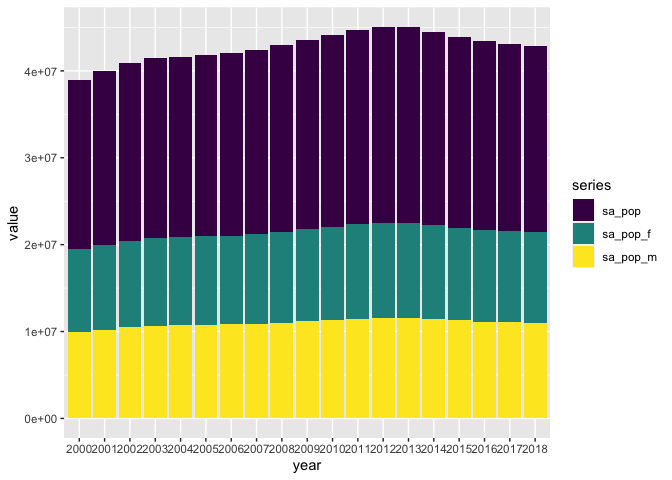

cleaning-script
================

## Package Loading

``` r
library(tidyverse)
```

    ## Warning: replacing previous import 'lifecycle::last_warnings' by
    ## 'rlang::last_warnings' when loading 'pillar'

    ## Warning: replacing previous import 'lifecycle::last_warnings' by
    ## 'rlang::last_warnings' when loading 'tibble'

    ## Warning: replacing previous import 'lifecycle::last_warnings' by
    ## 'rlang::last_warnings' when loading 'hms'

    ## ── Attaching packages ─────────────────────────────────────── tidyverse 1.3.1 ──

    ## ✓ ggplot2 3.3.5     ✓ purrr   0.3.4
    ## ✓ tibble  3.1.2     ✓ dplyr   1.0.6
    ## ✓ tidyr   1.1.3     ✓ stringr 1.4.0
    ## ✓ readr   1.4.0     ✓ forcats 0.5.1

    ## ── Conflicts ────────────────────────────────────────── tidyverse_conflicts() ──
    ## x dplyr::filter() masks stats::filter()
    ## x dplyr::lag()    masks stats::lag()

``` r
library(ggpubr)
```

## Data Loading

``` r
us_enrollment_data <- read.csv("/Users/kenjinchang/github/projected-impact-model/parent-datasets/us_enrollment_data.csv") %>%
  as_tibble()
us_enrollment_data
```

    ## # A tibble: 11 x 23
    ##    Country.Name  Country.Code Series Series.Code  YR2000  YR2001  YR2002  YR2003
    ##    <chr>         <chr>        <chr>  <chr>         <dbl>   <dbl>   <dbl>   <dbl>
    ##  1 "United Stat… "USA"        "Scho… "SP.TER.TO…  1.95e7  2.00e7  2.04e7  2.07e7
    ##  2 "United Stat… "USA"        "Scho… "SP.TER.TO…  9.51e6  9.74e6  9.96e6  1.01e7
    ##  3 "United Stat… "USA"        "Scho… "SP.TER.TO…  9.96e6  1.02e7  1.05e7  1.06e7
    ##  4 "United Stat… "USA"        "Gros… "SE.TER.EN…  6.78e1  6.81e1  7.79e1  8.02e1
    ##  5 "United Stat… "USA"        "Gros… "SE.TER.EN…  7.74e1  7.80e1  9.01e1  9.33e1
    ##  6 "United Stat… "USA"        "Gros… "SE.TER.EN…  5.86e1  5.87e1  6.64e1  6.77e1
    ##  7 ""            ""           ""     ""          NA      NA      NA      NA     
    ##  8 ""            ""           ""     ""          NA      NA      NA      NA     
    ##  9 ""            ""           ""     ""          NA      NA      NA      NA     
    ## 10 "Data from d… ""           ""     ""          NA      NA      NA      NA     
    ## 11 "Last Update… ""           ""     ""          NA      NA      NA      NA     
    ## # … with 15 more variables: YR2004 <dbl>, YR2005 <dbl>, YR2006 <dbl>,
    ## #   YR2007 <dbl>, YR2008 <dbl>, YR2009 <dbl>, YR2010 <dbl>, YR2011 <dbl>,
    ## #   YR2012 <dbl>, YR2013 <dbl>, YR2014 <dbl>, YR2015 <dbl>, YR2016 <dbl>,
    ## #   YR2017 <dbl>, YR2018 <dbl>

``` r
us_enrollment_data <- read.csv("/Users/kenjinchang/github/projected-impact-model/parent-datasets/us_enrollment_data.csv") %>% 
  select(-Country.Code,-Series.Code) %>%
  as_tibble(us_enrollment_data) %>%
  slice(1:(n()-5)) %>%
  rename(country=Country.Name,series=Series,yr2000=YR2000,yr2001=YR2001,yr2002=YR2002,yr2003=YR2003,yr2004=YR2004,yr2005=YR2005,yr2006=YR2006,yr2007=YR2007,yr2008=YR2008,yr2009=YR2009,yr2010=YR2010,yr2011=YR2011,yr2012=YR2012,yr2013=YR2013,yr2014=YR2014,yr2015=YR2015,yr2016=YR2016,yr2017=YR2017,yr2018=YR2018) 
us_enrollment_data 
```

    ## # A tibble: 6 x 21
    ##   country  series yr2000 yr2001 yr2002 yr2003 yr2004 yr2005 yr2006 yr2007 yr2008
    ##   <chr>    <chr>   <dbl>  <dbl>  <dbl>  <dbl>  <dbl>  <dbl>  <dbl>  <dbl>  <dbl>
    ## 1 United … Schoo… 1.95e7 2.00e7 2.04e7 2.07e7 2.08e7 2.09e7 2.10e7 2.12e7 2.15e7
    ## 2 United … Schoo… 9.51e6 9.74e6 9.96e6 1.01e7 1.01e7 1.02e7 1.02e7 1.03e7 1.04e7
    ## 3 United … Schoo… 9.96e6 1.02e7 1.05e7 1.06e7 1.07e7 1.08e7 1.08e7 1.09e7 1.10e7
    ## 4 United … Gross… 6.78e1 6.81e1 7.79e1 8.02e1 8.12e1 8.06e1 8.31e1 8.37e1 8.50e1
    ## 5 United … Gross… 7.74e1 7.80e1 9.01e1 9.33e1 9.53e1 9.52e1 9.83e1 9.88e1 9.99e1
    ## 6 United … Gross… 5.86e1 5.87e1 6.64e1 6.77e1 6.78e1 6.69e1 6.88e1 6.94e1 7.09e1
    ## # … with 10 more variables: yr2009 <dbl>, yr2010 <dbl>, yr2011 <dbl>,
    ## #   yr2012 <dbl>, yr2013 <dbl>, yr2014 <dbl>, yr2015 <dbl>, yr2016 <dbl>,
    ## #   yr2017 <dbl>, yr2018 <dbl>

``` r
us_enrollment_data <- read.csv("/Users/kenjinchang/github/projected-impact-model/parent-datasets/us_enrollment_data.csv") %>%
  select(-Country.Code,-Series.Code) %>%
  as_tibble(us_enrollment_data) %>%
  slice(1:(n()-5)) %>%
  rename(country=Country.Name,series=Series,yr2000=YR2000,yr2001=YR2001,yr2002=YR2002,yr2003=YR2003,yr2004=YR2004,yr2005=YR2005,yr2006=YR2006,yr2007=YR2007,yr2008=YR2008,yr2009=YR2009,yr2010=YR2010,yr2011=YR2011,yr2012=YR2012,yr2013=YR2013,yr2014=YR2014,yr2015=YR2015,yr2016=YR2016,yr2017=YR2017,yr2018=YR2018) %>%
  mutate_at(c("yr2000","yr2001","yr2002","yr2003","yr2004","yr2005","yr2006","yr2007","yr2008","yr2009","yr2010","yr2011","yr2012","yr2013","yr2014","yr2015","yr2016","yr2017","yr2018"),as.double)
us_enrollment_data
```

    ## # A tibble: 6 x 21
    ##   country  series yr2000 yr2001 yr2002 yr2003 yr2004 yr2005 yr2006 yr2007 yr2008
    ##   <chr>    <chr>   <dbl>  <dbl>  <dbl>  <dbl>  <dbl>  <dbl>  <dbl>  <dbl>  <dbl>
    ## 1 United … Schoo… 1.95e7 2.00e7 2.04e7 2.07e7 2.08e7 2.09e7 2.10e7 2.12e7 2.15e7
    ## 2 United … Schoo… 9.51e6 9.74e6 9.96e6 1.01e7 1.01e7 1.02e7 1.02e7 1.03e7 1.04e7
    ## 3 United … Schoo… 9.96e6 1.02e7 1.05e7 1.06e7 1.07e7 1.08e7 1.08e7 1.09e7 1.10e7
    ## 4 United … Gross… 6.78e1 6.81e1 7.79e1 8.02e1 8.12e1 8.06e1 8.31e1 8.37e1 8.50e1
    ## 5 United … Gross… 7.74e1 7.80e1 9.01e1 9.33e1 9.53e1 9.52e1 9.83e1 9.88e1 9.99e1
    ## 6 United … Gross… 5.86e1 5.87e1 6.64e1 6.77e1 6.78e1 6.69e1 6.88e1 6.94e1 7.09e1
    ## # … with 10 more variables: yr2009 <dbl>, yr2010 <dbl>, yr2011 <dbl>,
    ## #   yr2012 <dbl>, yr2013 <dbl>, yr2014 <dbl>, yr2015 <dbl>, yr2016 <dbl>,
    ## #   yr2017 <dbl>, yr2018 <dbl>

``` r
us_enrollment_data <- read.csv("/Users/kenjinchang/github/projected-impact-model/parent-datasets/us_enrollment_data.csv") %>%
  select(-Country.Code,-Series.Code) %>%
  as_tibble(us_enrollment_data) %>%
  slice(1:(n()-5)) %>%
  rename(country=Country.Name,series=Series,yr2000=YR2000,yr2001=YR2001,yr2002=YR2002,yr2003=YR2003,yr2004=YR2004,yr2005=YR2005,yr2006=YR2006,yr2007=YR2007,yr2008=YR2008,yr2009=YR2009,yr2010=YR2010,yr2011=YR2011,yr2012=YR2012,yr2013=YR2013,yr2014=YR2014,yr2015=YR2015,yr2016=YR2016,yr2017=YR2017,yr2018=YR2018) %>%
  mutate_at(c("yr2000","yr2001","yr2002","yr2003","yr2004","yr2005","yr2006","yr2007","yr2008","yr2009","yr2010","yr2011","yr2012","yr2013","yr2014","yr2015","yr2016","yr2017","yr2018"),as.double) %>%
  replace(is.na(.),0)
us_enrollment_data
```

    ## # A tibble: 6 x 21
    ##   country  series yr2000 yr2001 yr2002 yr2003 yr2004 yr2005 yr2006 yr2007 yr2008
    ##   <chr>    <chr>   <dbl>  <dbl>  <dbl>  <dbl>  <dbl>  <dbl>  <dbl>  <dbl>  <dbl>
    ## 1 United … Schoo… 1.95e7 2.00e7 2.04e7 2.07e7 2.08e7 2.09e7 2.10e7 2.12e7 2.15e7
    ## 2 United … Schoo… 9.51e6 9.74e6 9.96e6 1.01e7 1.01e7 1.02e7 1.02e7 1.03e7 1.04e7
    ## 3 United … Schoo… 9.96e6 1.02e7 1.05e7 1.06e7 1.07e7 1.08e7 1.08e7 1.09e7 1.10e7
    ## 4 United … Gross… 6.78e1 6.81e1 7.79e1 8.02e1 8.12e1 8.06e1 8.31e1 8.37e1 8.50e1
    ## 5 United … Gross… 7.74e1 7.80e1 9.01e1 9.33e1 9.53e1 9.52e1 9.83e1 9.88e1 9.99e1
    ## 6 United … Gross… 5.86e1 5.87e1 6.64e1 6.77e1 6.78e1 6.69e1 6.88e1 6.94e1 7.09e1
    ## # … with 10 more variables: yr2009 <dbl>, yr2010 <dbl>, yr2011 <dbl>,
    ## #   yr2012 <dbl>, yr2013 <dbl>, yr2014 <dbl>, yr2015 <dbl>, yr2016 <dbl>,
    ## #   yr2017 <dbl>, yr2018 <dbl>

``` r
us_enrollment_data <- read.csv("/Users/kenjinchang/github/projected-impact-model/parent-datasets/us_enrollment_data.csv") %>%
  select(-Country.Code,-Series.Code) %>%
  as_tibble(us_enrollment_data) %>%
  slice(1:(n()-5)) %>%
  rename(country=Country.Name,series=Series,yr2000=YR2000,yr2001=YR2001,yr2002=YR2002,yr2003=YR2003,yr2004=YR2004,yr2005=YR2005,yr2006=YR2006,yr2007=YR2007,yr2008=YR2008,yr2009=YR2009,yr2010=YR2010,yr2011=YR2011,yr2012=YR2012,yr2013=YR2013,yr2014=YR2014,yr2015=YR2015,yr2016=YR2016,yr2017=YR2017,yr2018=YR2018) %>%
  mutate_at(c("yr2000","yr2001","yr2002","yr2003","yr2004","yr2005","yr2006","yr2007","yr2008","yr2009","yr2010","yr2011","yr2012","yr2013","yr2014","yr2015","yr2016","yr2017","yr2018"),as.double) %>%
  replace(is.na(.),0) %>%
  distinct() %>%
  mutate(across("series",str_replace, fixed("School age population, tertiary education, both sexes (number)"),"sa_pop")) %>%
  mutate(across("series",str_replace, fixed("School age population, tertiary education, female (number)"),"sa_pop_f")) %>%
  mutate(across("series",str_replace, fixed("School age population, tertiary education, male (number)"),"sa_pop_m")) %>%
  mutate(across("series",str_replace, fixed("Gross enrolment ratio for tertiary education, both sexes (%)"),"enr_rat")) %>%
  mutate(across("series",str_replace, fixed("Gross enrolment ratio for tertiary education, female (%)"),"enr_rat_f")) %>%
  mutate(across("series",str_replace, fixed("Gross enrolment ratio for tertiary education, male (%)"),"enr_rat_m")) %>%
  pivot_longer(cols=starts_with("yr"), names_to="year",names_prefix="yr",values_to="value",values_drop_na=TRUE)
us_enrollment_data
```

    ## # A tibble: 114 x 4
    ##    country       series year     value
    ##    <chr>         <chr>  <chr>    <dbl>
    ##  1 United States sa_pop 2000  19472577
    ##  2 United States sa_pop 2001  19964936
    ##  3 United States sa_pop 2002  20444718
    ##  4 United States sa_pop 2003  20724253
    ##  5 United States sa_pop 2004  20824783
    ##  6 United States sa_pop 2005  20941658
    ##  7 United States sa_pop 2006  21049542
    ##  8 United States sa_pop 2007  21215121
    ##  9 United States sa_pop 2008  21465844
    ## 10 United States sa_pop 2009  21801392
    ## # … with 104 more rows

``` r
us_enrollment_data %>%
  select(series,year,value) %>%
  filter(series=="sa_pop"|series=="sa_pop_f"|series=="sa_pop_m") %>%
  ggplot(aes(x=year,y=value,fill=series)) + 
    geom_col() + 
  scale_fill_viridis_d()
```

<!-- -->

``` r
us_enrollment_data %>%
  select(series,year,value) %>%
  filter(series=="sa_pop"|series=="sa_pop_f"|series=="sa_pop_m") %>%
  mutate(year=factor(year,levels=unique(year))) %>%
  ggplot(aes(year,value,color=series,group=series)) +
  geom_line() + 
  geom_point(size=.5) +
  scale_color_viridis_d() + 
  ylim(0,24000000)
```

<!-- -->
