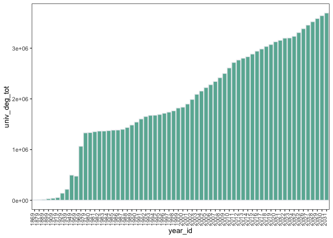
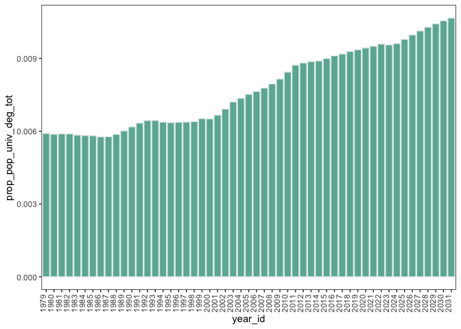
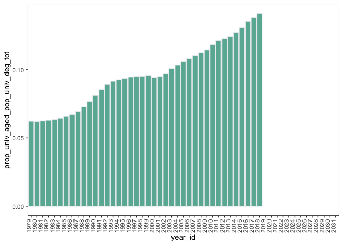

cleaning-script
================

## package loading

loading in the relevant CRAN packages.

``` r
library(tidyverse)
```

    ## ── Attaching packages ─────────────────────────────────────── tidyverse 1.3.2 ──
    ## ✔ ggplot2 3.4.1      ✔ purrr   0.3.4 
    ## ✔ tibble  3.1.8      ✔ dplyr   1.0.10
    ## ✔ tidyr   1.2.1      ✔ stringr 1.4.1 
    ## ✔ readr   2.1.2      ✔ forcats 0.5.2 
    ## ── Conflicts ────────────────────────────────────────── tidyverse_conflicts() ──
    ## ✖ dplyr::filter() masks stats::filter()
    ## ✖ dplyr::lag()    masks stats::lag()

``` r
library(ggpubr)
```

## data loading

loading in the US enrollment data from the `parent-dataset` folder

``` r
as_tibble(read.csv("/Users/kenjinchang/github/projected-impact-model/parent-datasets/enrollment_projections.csv"))
```

    ## # A tibble: 73 × 20
    ##    Table.318…¹ X     X.1   X.2   X.3   X.4   X.5   X.6   X.7   X.8   X.9   X.10 
    ##    <chr>       <chr> <chr> <chr> <chr> <chr> <chr> <chr> <chr> <chr> <chr> <chr>
    ##  1 Year        "Ass… "Ass… "Ass… "Ass… Bach… "Bac… Bach… "Bac… Bach… "Bac… Bach…
    ##  2 Year        "Tot… "Mal… "Fem… "Per… Total "Tot… Males "Mal… Fema… "Fem… Perc…
    ##  3 1           "2"   "3"   "4"   "5"   6     "6"   7     "7"   8     "8"   9    
    ##  4 1869-70     ""    ""    ""    ""    9371… "\\2… 7993… "\\2… 1378… "\\2… 14.70
    ##  5 1879-80     ""    ""    ""    ""    1289… "\\2… 1041… "\\2… 2485… "\\2… 19.30
    ##  6 1889-90     ""    ""    ""    ""    1553… "\\2… 1285… "\\2… 2682… "\\2… 17.30
    ##  7 1899-1900   ""    ""    ""    ""    2741… "\\2… 2217… "\\2… 5237… "\\2… 19.10
    ##  8 1909-10     ""    ""    ""    ""    3719… "\\2… 2876… "\\2… 8437… "\\2… 22.70
    ##  9 1919-20     ""    ""    ""    ""    4862… "\\2… 3198… "\\2… 1664… "\\2… 34.20
    ## 10 1929-30     ""    ""    ""    ""    1224… "\\2… 7361… "\\2… 4886… "\\2… 39.90
    ## # … with 63 more rows, 8 more variables: X.11 <chr>, X.12 <chr>, X.13 <chr>,
    ## #   X.14 <chr>, X.15 <chr>, X.16 <chr>, X.17 <chr>, X.18 <chr>, and abbreviated
    ## #   variable name
    ## #   ¹​Table.318.10..Degrees.conferred.by.postsecondary.institutions..by.level.of.degree.and.sex.of.student..Selected.academic.years..1869.70.through.2031.32

performing the necessary cleaning procedures to make the parent dataset
suitable for our analyses

in order, we:

1.  omit the initial two rows that correspond to (1) the title of the
    table and and (2) the numeric column identifiers

2.  omit the degree-level percent-female variables

3.  rename the variables for brevity

4.  omit the row specifying the variable ID

5.  omit the source information and table notes from the tibble

6.  renamed the columns dichotomously indicating whether the
    corresponding bachelor-level enrollment value include degrees
    classified as master’s or doctor’s degree in later years

7.  changed column values within the the `bach_deg_tot_assoc`,
    `bach_deg_m_assoc`, and `bach_deg_f_assoc` from `\\2\\` to `1` and
    `0`, with `1` corresponding to enrollment totals that do incoude
    degrees classified as master’s or doctor’s degrees in later years
    and `0` corresponding to enrollment totals that do not

8.  changed columns from character strings to numeric strings

9.  replaced `NA` values with `0` values

10. generated new columns aggregating the number of degrees earned, both
    as a total and across sexes, between bachelor’s, master’s, and
    doctoral programs

11. generated new columns calculating the proportion of university
    degrees contributed by bachelor’s, master’s, and doctoral programs

12. added an identifying column (by year) for joining purposes

``` r
enrollment_data <- as_tibble(read.csv("/Users/kenjinchang/github/projected-impact-model/parent-datasets/enrollment_projections.csv",skip=1)) %>%
  filter(!row_number() %in% c(2)) %>%
  select(!c(Associate.s.degrees.3,Bachelor.s.degrees.6,Master.s.degrees.3,Doctor.s.degrees.1..3)) %>%
  rename(acad.year=Year,assoc_deg_tot=Associate.s.degrees,assoc_deg_m=Associate.s.degrees.1,assoc_deg_f=Associate.s.degrees.2,bach_deg_tot=Bachelor.s.degrees,bach_deg_m=Bachelor.s.degrees.2,bach_deg_f=Bachelor.s.degrees.4,mast_deg_tot=Master.s.degrees,mast_deg_m=Master.s.degrees.1,mast_deg_f=Master.s.degrees.2,doct_deg_tot=Doctor.s.degrees.1.,doct_deg_m=Doctor.s.degrees.1..1,doct_deg_f=Doctor.s.degrees.1..2) %>%
  filter(!row_number() %in% c(1,66,67,68,69,70,71)) %>%
  rename(bach_deg_tot_assoc=Bachelor.s.degrees.1,bach_deg_m_assoc=Bachelor.s.degrees.3,bach_deg_f_assoc=Bachelor.s.degrees.5) %>%
  mutate(bach_deg_tot_assoc=replace(bach_deg_tot_assoc, bach_deg_tot_assoc != "\\2\\","0")) %>%
  mutate(bach_deg_tot_assoc=replace(bach_deg_tot_assoc, bach_deg_tot_assoc == "\\2\\","1")) %>%
  mutate(bach_deg_m_assoc=replace(bach_deg_m_assoc, bach_deg_m_assoc != "\\2\\","0")) %>%
  mutate(bach_deg_m_assoc=replace(bach_deg_m_assoc, bach_deg_m_assoc == "\\2\\","1")) %>%
  mutate(bach_deg_f_assoc=replace(bach_deg_f_assoc, bach_deg_f_assoc != "\\2\\","0")) %>%
  mutate(bach_deg_f_assoc=replace(bach_deg_f_assoc, bach_deg_f_assoc == "\\2\\","1")) %>%
  mutate(assoc_deg_tot=as.double(assoc_deg_tot)) %>%
  mutate(assoc_deg_m=as.double(assoc_deg_m)) %>%
  mutate(assoc_deg_f=as.double(assoc_deg_f)) %>%
  mutate(bach_deg_tot=as.double(bach_deg_tot)) %>%
  mutate(bach_deg_tot_assoc=as.double(bach_deg_tot_assoc)) %>%
  mutate(bach_deg_m=as.double(bach_deg_m)) %>%
  mutate(bach_deg_m_assoc=as.double(bach_deg_m_assoc)) %>%
  mutate(bach_deg_f=as.double(bach_deg_f)) %>%
  mutate(bach_deg_f_assoc=as.double(bach_deg_f_assoc)) %>%
  mutate(mast_deg_tot=as.double(mast_deg_tot)) %>%
  mutate(mast_deg_m=as.double(mast_deg_m)) %>%
  mutate(mast_deg_f=as.double(mast_deg_f)) %>%
  mutate(doct_deg_tot=as.double(doct_deg_tot)) %>%
  mutate(doct_deg_m=as.double(doct_deg_m)) %>%
  mutate(doct_deg_f=as.double(doct_deg_f)) %>%
  replace(is.na(.), 0) %>%
  mutate(univ_deg_tot=bach_deg_tot+mast_deg_tot+doct_deg_tot) %>%
  mutate(univ_deg_m=bach_deg_m+mast_deg_m+doct_deg_m) %>%
  mutate(univ_deg_f=bach_deg_f+mast_deg_f+doct_deg_f) %>%
  mutate(perc_bach_tot=bach_deg_tot/univ_deg_tot) %>%
  mutate(perc_mast_tot=mast_deg_tot/univ_deg_tot) %>%
  mutate(perc_doct_tot=doct_deg_tot/univ_deg_tot) %>%
  separate(acad.year,"year_id",sep="-",remove=FALSE)
```

    ## Warning: Expected 1 pieces. Additional pieces discarded in 64 rows [1, 2, 3, 4,
    ## 5, 6, 7, 8, 9, 10, 11, 12, 13, 14, 15, 16, 17, 18, 19, 20, ...].

``` r
enrollment_data
```

    ## # A tibble: 64 × 23
    ##    acad.year year_id assoc_deg…¹ assoc…² assoc…³ bach_…⁴ bach_…⁵ bach_…⁶ bach_…⁷
    ##    <chr>     <chr>         <dbl>   <dbl>   <dbl>   <dbl>   <dbl>   <dbl>   <dbl>
    ##  1 1869-70   1869              0       0       0    9371       1    7993       1
    ##  2 1879-80   1879              0       0       0   12896       1   10411       1
    ##  3 1889-90   1889              0       0       0   15539       1   12857       1
    ##  4 1899-1900 1899              0       0       0   27410       1   22173       1
    ##  5 1909-10   1909              0       0       0   37199       1   28762       1
    ##  6 1919-20   1919              0       0       0   48622       1   31980       1
    ##  7 1929-30   1929              0       0       0  122484       1   73615       1
    ##  8 1939-40   1939              0       0       0  186500       1  109546       1
    ##  9 1949-50   1949              0       0       0  432058       1  328841       1
    ## 10 1959-60   1959              0       0       0  392440       1  254063       1
    ## # … with 54 more rows, 14 more variables: bach_deg_f <dbl>,
    ## #   bach_deg_f_assoc <dbl>, mast_deg_tot <dbl>, mast_deg_m <dbl>,
    ## #   mast_deg_f <dbl>, doct_deg_tot <dbl>, doct_deg_m <dbl>, doct_deg_f <dbl>,
    ## #   univ_deg_tot <dbl>, univ_deg_m <dbl>, univ_deg_f <dbl>,
    ## #   perc_bach_tot <dbl>, perc_mast_tot <dbl>, perc_doct_tot <dbl>, and
    ## #   abbreviated variable names ¹​assoc_deg_tot, ²​assoc_deg_m, ³​assoc_deg_f,
    ## #   ⁴​bach_deg_tot, ⁵​bach_deg_tot_assoc, ⁶​bach_deg_m, ⁷​bach_deg_m_assoc

## preliminary data exploration

looking at the number of people enrolled in university over time

``` r
ggplot(enrollment_data,aes(x=acad.year,y=univ_deg_tot)) +
  geom_col(fill="#69b3a2",color="#e9ecef") + 
  theme(panel.grid.minor=element_blank(),panel.border=element_rect(color="black",fill="transparent"),panel.background=element_rect(fill="transparent"),axis.text.x=element_text(angle=90,vjust=0,hjust=0))
```

<!-- -->

because it’s useful to see this as a function of the national
population, we take census projections and estimates to highlighting how
enrollment changes relative to changes in the population

this helps to illustrate the role of intervening within these contexts
and how it is expected to change over time

in taking the census data, which provides projections from 2022 to 2100,
we then take the following steps to clean the data in preparation for a
join:

1.  omit the initial few rows containing the title of table and
    nonessential descriptive information

2.  identify and select the relevant columns

3.  properly align the rows so that each year corresponds to the correct
    projection

4.  multiply the projection by a factor of 1000 to align the units of
    analysis

5.  remove table footnotes

6.  rename the variables so that they are consistent with our naming
    conventions

``` r
population_projections <- as_tibble(read.csv("/Users/kenjinchang/github/projected-impact-model/parent-datasets/population_projections.csv",skip=4)) %>%
  select(Year,Population) %>%
  mutate(population=as.numeric(Population)*1000) %>%
  filter(!row_number() %in% c(1,2,3,3,4,82,83,84,85,86,87,88,89)) %>%
  rename(year_id=Year) %>%
  select(!Population)
population_projections
```

    ## # A tibble: 77 × 2
    ##    year_id population
    ##    <chr>        <dbl>
    ##  1 2024     336482000
    ##  2 2025     338016000
    ##  3 2026     339513000
    ##  4 2027     340970000
    ##  5 2028     342385000
    ##  6 2029     343754000
    ##  7 2030     345074000
    ##  8 2031     346339000
    ##  9 2032     347545000
    ## 10 2033     348702000
    ## # … with 67 more rows

mutate_at(c(“Population”),funs(lead),n=2) %\>%

now, we use a `left_join` command to add all matching columns from the
`population_projections` tibble to the `enrollment_data` tibble:

``` r
X20242031 <- left_join(enrollment_data,population_projections)
```

    ## Joining, by = "year_id"

``` r
X20242031
```

    ## # A tibble: 64 × 24
    ##    acad.year year_id assoc_deg…¹ assoc…² assoc…³ bach_…⁴ bach_…⁵ bach_…⁶ bach_…⁷
    ##    <chr>     <chr>         <dbl>   <dbl>   <dbl>   <dbl>   <dbl>   <dbl>   <dbl>
    ##  1 1869-70   1869              0       0       0    9371       1    7993       1
    ##  2 1879-80   1879              0       0       0   12896       1   10411       1
    ##  3 1889-90   1889              0       0       0   15539       1   12857       1
    ##  4 1899-1900 1899              0       0       0   27410       1   22173       1
    ##  5 1909-10   1909              0       0       0   37199       1   28762       1
    ##  6 1919-20   1919              0       0       0   48622       1   31980       1
    ##  7 1929-30   1929              0       0       0  122484       1   73615       1
    ##  8 1939-40   1939              0       0       0  186500       1  109546       1
    ##  9 1949-50   1949              0       0       0  432058       1  328841       1
    ## 10 1959-60   1959              0       0       0  392440       1  254063       1
    ## # … with 54 more rows, 15 more variables: bach_deg_f <dbl>,
    ## #   bach_deg_f_assoc <dbl>, mast_deg_tot <dbl>, mast_deg_m <dbl>,
    ## #   mast_deg_f <dbl>, doct_deg_tot <dbl>, doct_deg_m <dbl>, doct_deg_f <dbl>,
    ## #   univ_deg_tot <dbl>, univ_deg_m <dbl>, univ_deg_f <dbl>,
    ## #   perc_bach_tot <dbl>, perc_mast_tot <dbl>, perc_doct_tot <dbl>,
    ## #   population <dbl>, and abbreviated variable names ¹​assoc_deg_tot,
    ## #   ²​assoc_deg_m, ³​assoc_deg_f, ⁴​bach_deg_tot, ⁵​bach_deg_tot_assoc, …

as we did for the census-provided population projections, we now do the
same for the census-provided population estimates. we do this in three
parts because of how the national-population-estimate data is provided.

``` r
population_estimates_20202023 <- as_tibble(read.csv("/Users/kenjinchang/github/projected-impact-model/parent-datasets/population_estimates_20202023.csv",skip=3)) %>%
  filter(row_number() %in% c(1)) %>%
  select(X,X2020,X2021,X2022,X2023) %>%
  rename("2020"=X2020,"2021"=X2021,"2022"=X2022,"2023"=X2023) %>%
  pivot_longer(!X,names_to="year_id", values_to="population") %>%
  select(!X) %>%
  mutate(population=as.numeric(population))
population_estimates_20202023
```

    ## # A tibble: 4 × 2
    ##   year_id population
    ##   <chr>        <dbl>
    ## 1 2020     331526933
    ## 2 2021     332048977
    ## 3 2022     333271411
    ## 4 2023     334914895

with the 2020-2023 data now in an appropriate format, we can join these
values to `enrollment_data`, as we did for the population projections

``` r
X20202023 <- left_join(enrollment_data,population_estimates_20202023) 
```

    ## Joining, by = "year_id"

``` r
X20202023
```

    ## # A tibble: 64 × 24
    ##    acad.year year_id assoc_deg…¹ assoc…² assoc…³ bach_…⁴ bach_…⁵ bach_…⁶ bach_…⁷
    ##    <chr>     <chr>         <dbl>   <dbl>   <dbl>   <dbl>   <dbl>   <dbl>   <dbl>
    ##  1 1869-70   1869              0       0       0    9371       1    7993       1
    ##  2 1879-80   1879              0       0       0   12896       1   10411       1
    ##  3 1889-90   1889              0       0       0   15539       1   12857       1
    ##  4 1899-1900 1899              0       0       0   27410       1   22173       1
    ##  5 1909-10   1909              0       0       0   37199       1   28762       1
    ##  6 1919-20   1919              0       0       0   48622       1   31980       1
    ##  7 1929-30   1929              0       0       0  122484       1   73615       1
    ##  8 1939-40   1939              0       0       0  186500       1  109546       1
    ##  9 1949-50   1949              0       0       0  432058       1  328841       1
    ## 10 1959-60   1959              0       0       0  392440       1  254063       1
    ## # … with 54 more rows, 15 more variables: bach_deg_f <dbl>,
    ## #   bach_deg_f_assoc <dbl>, mast_deg_tot <dbl>, mast_deg_m <dbl>,
    ## #   mast_deg_f <dbl>, doct_deg_tot <dbl>, doct_deg_m <dbl>, doct_deg_f <dbl>,
    ## #   univ_deg_tot <dbl>, univ_deg_m <dbl>, univ_deg_f <dbl>,
    ## #   perc_bach_tot <dbl>, perc_mast_tot <dbl>, perc_doct_tot <dbl>,
    ## #   population <dbl>, and abbreviated variable names ¹​assoc_deg_tot,
    ## #   ²​assoc_deg_m, ³​assoc_deg_f, ⁴​bach_deg_tot, ⁵​bach_deg_tot_assoc, …

``` r
population_estimates_20102019 <- as_tibble(read.csv("/Users/kenjinchang/github/projected-impact-model/parent-datasets/population_estimates_20102019.csv",skip=3)) %>%
  filter(row_number() %in% c(1)) %>%
  select(X,X2010,X2011,X2012,X2013,X2014,X2015,X2016,X2017,X2018,X2019) %>%
  rename("2010"=X2010,"2011"=X2011,"2012"=X2012,"2013"=X2013,"2014"=X2014,"2015"=X2015,"2016"=X2016,"2017"=X2017,"2018"=X2018,"2019"=X2019) %>%
  pivot_longer(!X,names_to="year_id", values_to="population") %>%
  select(!X) %>%
  mutate(population=as.numeric(population))
population_estimates_20102019
```

    ## # A tibble: 10 × 2
    ##    year_id population
    ##    <chr>        <dbl>
    ##  1 2010     309321666
    ##  2 2011     311556874
    ##  3 2012     313830990
    ##  4 2013     315993715
    ##  5 2014     318301008
    ##  6 2015     320635163
    ##  7 2016     322941311
    ##  8 2017     324985539
    ##  9 2018     326687501
    ## 10 2019     328239523

with the 2010-2019 data now in an appropriate format, we can join these
values to `enrollment_data`, as we did for the 2020-2023 estimates

``` r
X20102019 <- left_join(enrollment_data,population_estimates_20102019) 
```

    ## Joining, by = "year_id"

``` r
X20102019
```

    ## # A tibble: 64 × 24
    ##    acad.year year_id assoc_deg…¹ assoc…² assoc…³ bach_…⁴ bach_…⁵ bach_…⁶ bach_…⁷
    ##    <chr>     <chr>         <dbl>   <dbl>   <dbl>   <dbl>   <dbl>   <dbl>   <dbl>
    ##  1 1869-70   1869              0       0       0    9371       1    7993       1
    ##  2 1879-80   1879              0       0       0   12896       1   10411       1
    ##  3 1889-90   1889              0       0       0   15539       1   12857       1
    ##  4 1899-1900 1899              0       0       0   27410       1   22173       1
    ##  5 1909-10   1909              0       0       0   37199       1   28762       1
    ##  6 1919-20   1919              0       0       0   48622       1   31980       1
    ##  7 1929-30   1929              0       0       0  122484       1   73615       1
    ##  8 1939-40   1939              0       0       0  186500       1  109546       1
    ##  9 1949-50   1949              0       0       0  432058       1  328841       1
    ## 10 1959-60   1959              0       0       0  392440       1  254063       1
    ## # … with 54 more rows, 15 more variables: bach_deg_f <dbl>,
    ## #   bach_deg_f_assoc <dbl>, mast_deg_tot <dbl>, mast_deg_m <dbl>,
    ## #   mast_deg_f <dbl>, doct_deg_tot <dbl>, doct_deg_m <dbl>, doct_deg_f <dbl>,
    ## #   univ_deg_tot <dbl>, univ_deg_m <dbl>, univ_deg_f <dbl>,
    ## #   perc_bach_tot <dbl>, perc_mast_tot <dbl>, perc_doct_tot <dbl>,
    ## #   population <dbl>, and abbreviated variable names ¹​assoc_deg_tot,
    ## #   ²​assoc_deg_m, ³​assoc_deg_f, ⁴​bach_deg_tot, ⁵​bach_deg_tot_assoc, …

``` r
population_estimates_19702009 <- as_tibble(read.csv("/Users/kenjinchang/github/projected-impact-model/parent-datasets/population_estimates_19702018.csv",skip=0)) %>%
  filter(row_number() %in% c(1)) %>%
  select(Country.Name,X1970..YR1970.,X1971..YR1971.,X1972..YR1972.,X1973..YR1973.,X1974..YR1974.,X1975..YR1975.,X1976..YR1976.,X1977..YR1977.,X1978..YR1978.,X1979..YR1979.,X1980..YR1980.,X1981..YR1981.,X1982..YR1982.,X1983..YR1983.,X1984..YR1984.,X1985..YR1985.,X1986..YR1986.,X1987..YR1987.,X1988..YR1988.,X1989..YR1989.,X1990..YR1990.,X1991..YR1991.,X1992..YR1992.,X1993..YR1993.,X1994..YR1994.,X1995..YR1995.,X1996..YR1996.,X1997..YR1997.,X1998..YR1998.,X1999..YR1999.,X2000..YR2000.,X2001..YR2001.,X2002..YR2002.,X2003..YR2003.,X2004..YR2004.,X2005..YR2005.,X2006..YR2006.,X2007..YR2007.,X2008..YR2008.,X2009..YR2009.) %>%
  rename("1970"=X1970..YR1970.,"1971"=X1971..YR1971.,"1972"=X1972..YR1972.,"1973"=X1973..YR1973.,"1974"=X1974..YR1974.,"1975"=X1975..YR1975.,"1976"=X1976..YR1976.,"1977"=X1977..YR1977.,"1978"=X1978..YR1978.,"1979"=X1979..YR1979.,"1980"=X1980..YR1980.,"1981"=X1981..YR1981.,"1982"=X1982..YR1982.,"1983"=X1983..YR1983.,"1984"=X1984..YR1984.,"1985"=X1985..YR1985.,"1986"=X1986..YR1986.,"1987"=X1987..YR1987.,"1988"=X1988..YR1988.,"1989"=X1989..YR1989.,"1990"=X1990..YR1990.,"1991"=X1991..YR1991.,"1992"=X1992..YR1992.,"1993"=X1993..YR1993.,"1994"=X1994..YR1994.,"1995"=X1995..YR1995.,"1996"=X1996..YR1996.,"1997"=X1997..YR1997.,"1998"=X1998..YR1998.,"1999"=X1999..YR1999.,"2000"=X2000..YR2000.,"2001"=X2001..YR2001.,"2002"=X2002..YR2002.,"2003"=X2003..YR2003.,"2004"=X2004..YR2004.,"2005"=X2005..YR2005.,"2006"=X2006..YR2006.,"2007"=X2007..YR2007.,"2008"=X2008..YR2008.,"2009"=X2009..YR2009.) %>%
  pivot_longer(!Country.Name,names_to="year_id", values_to="population") %>%
  select(!Country.Name) %>%
  mutate(population=as.numeric(population))
population_estimates_19702009
```

    ## # A tibble: 40 × 2
    ##    year_id population
    ##    <chr>        <dbl>
    ##  1 1970     205052000
    ##  2 1971     207661000
    ##  3 1972     209896000
    ##  4 1973     211909000
    ##  5 1974     213854000
    ##  6 1975     215973000
    ##  7 1976     218035000
    ##  8 1977     220239000
    ##  9 1978     222585000
    ## 10 1979     225055000
    ## # … with 30 more rows

with the 1970-2009 data now in an appropriate format, we can join these
values to `enrollment_data`, as we did for the 2020-2023 estimates

``` r
X19702009 <- left_join(enrollment_data,population_estimates_19702009) 
```

    ## Joining, by = "year_id"

``` r
X19702009
```

    ## # A tibble: 64 × 24
    ##    acad.year year_id assoc_deg…¹ assoc…² assoc…³ bach_…⁴ bach_…⁵ bach_…⁶ bach_…⁷
    ##    <chr>     <chr>         <dbl>   <dbl>   <dbl>   <dbl>   <dbl>   <dbl>   <dbl>
    ##  1 1869-70   1869              0       0       0    9371       1    7993       1
    ##  2 1879-80   1879              0       0       0   12896       1   10411       1
    ##  3 1889-90   1889              0       0       0   15539       1   12857       1
    ##  4 1899-1900 1899              0       0       0   27410       1   22173       1
    ##  5 1909-10   1909              0       0       0   37199       1   28762       1
    ##  6 1919-20   1919              0       0       0   48622       1   31980       1
    ##  7 1929-30   1929              0       0       0  122484       1   73615       1
    ##  8 1939-40   1939              0       0       0  186500       1  109546       1
    ##  9 1949-50   1949              0       0       0  432058       1  328841       1
    ## 10 1959-60   1959              0       0       0  392440       1  254063       1
    ## # … with 54 more rows, 15 more variables: bach_deg_f <dbl>,
    ## #   bach_deg_f_assoc <dbl>, mast_deg_tot <dbl>, mast_deg_m <dbl>,
    ## #   mast_deg_f <dbl>, doct_deg_tot <dbl>, doct_deg_m <dbl>, doct_deg_f <dbl>,
    ## #   univ_deg_tot <dbl>, univ_deg_m <dbl>, univ_deg_f <dbl>,
    ## #   perc_bach_tot <dbl>, perc_mast_tot <dbl>, perc_doct_tot <dbl>,
    ## #   population <dbl>, and abbreviated variable names ¹​assoc_deg_tot,
    ## #   ²​assoc_deg_m, ³​assoc_deg_f, ⁴​bach_deg_tot, ⁵​bach_deg_tot_assoc, …

at this stage, we have separately joined the `population` values from
each of the relevant data files, and we have input the values such that
there are no overlapping year entries, namely to prioritize inputting
population estimates over population projections, as the census
recommends

``` r
X19702031 <- bind_rows(population_estimates_19702009,population_estimates_20102019,population_estimates_20202023,population_projections)
X19702031
```

    ## # A tibble: 131 × 2
    ##    year_id population
    ##    <chr>        <dbl>
    ##  1 1970     205052000
    ##  2 1971     207661000
    ##  3 1972     209896000
    ##  4 1973     211909000
    ##  5 1974     213854000
    ##  6 1975     215973000
    ##  7 1976     218035000
    ##  8 1977     220239000
    ##  9 1978     222585000
    ## 10 1979     225055000
    ## # … with 121 more rows

now, we join these values to the original `enrollment_data` and remove
rows without population data

``` r
cleaned_data <- left_join(enrollment_data,X19702031) %>%
    filter(!row_number() %in% c(1,2,3,4,5,6,7,8,9,10,11))
```

    ## Joining, by = "year_id"

``` r
cleaned_data
```

    ## # A tibble: 53 × 24
    ##    acad.year year_id assoc_deg…¹ assoc…² assoc…³ bach_…⁴ bach_…⁵ bach_…⁶ bach_…⁷
    ##    <chr>     <chr>         <dbl>   <dbl>   <dbl>   <dbl>   <dbl>   <dbl>   <dbl>
    ##  1 1979-80   1979         400910  183737  217173  929417       0  473611       0
    ##  2 1980-81   1980         416377  188638  227739  935140       0  469883       0
    ##  3 1981-82   1981         434526  196944  237582  952998       0  473364       0
    ##  4 1982-83   1982         449620  203991  245629  969510       0  479140       0
    ##  5 1983-84   1983         452240  202704  249536  974309       0  482319       0
    ##  6 1984-85   1984         454712  202932  251780  979477       0  482528       0
    ##  7 1985-86   1985         446047  196166  249881  987823       0  485923       0
    ##  8 1986-87   1986         436304  190839  245465  991264       0  480782       0
    ##  9 1987-88   1987         435085  190047  245038  994829       0  477203       0
    ## 10 1988-89   1988         436764  186316  250448 1018755       0  483346       0
    ## # … with 43 more rows, 15 more variables: bach_deg_f <dbl>,
    ## #   bach_deg_f_assoc <dbl>, mast_deg_tot <dbl>, mast_deg_m <dbl>,
    ## #   mast_deg_f <dbl>, doct_deg_tot <dbl>, doct_deg_m <dbl>, doct_deg_f <dbl>,
    ## #   univ_deg_tot <dbl>, univ_deg_m <dbl>, univ_deg_f <dbl>,
    ## #   perc_bach_tot <dbl>, perc_mast_tot <dbl>, perc_doct_tot <dbl>,
    ## #   population <dbl>, and abbreviated variable names ¹​assoc_deg_tot,
    ## #   ²​assoc_deg_m, ³​assoc_deg_f, ⁴​bach_deg_tot, ⁵​bach_deg_tot_assoc, …

now, we can generate a new variable calculating the share of the
estimated (1979-20-and projected population that is estimated and
projected to be enrolled in

``` r
cleaned_data <- cleaned_data %>% mutate(prop_pop_univ_deg_tot=univ_deg_tot/population)
cleaned_data
```

    ## # A tibble: 53 × 25
    ##    acad.year year_id assoc_deg…¹ assoc…² assoc…³ bach_…⁴ bach_…⁵ bach_…⁶ bach_…⁷
    ##    <chr>     <chr>         <dbl>   <dbl>   <dbl>   <dbl>   <dbl>   <dbl>   <dbl>
    ##  1 1979-80   1979         400910  183737  217173  929417       0  473611       0
    ##  2 1980-81   1980         416377  188638  227739  935140       0  469883       0
    ##  3 1981-82   1981         434526  196944  237582  952998       0  473364       0
    ##  4 1982-83   1982         449620  203991  245629  969510       0  479140       0
    ##  5 1983-84   1983         452240  202704  249536  974309       0  482319       0
    ##  6 1984-85   1984         454712  202932  251780  979477       0  482528       0
    ##  7 1985-86   1985         446047  196166  249881  987823       0  485923       0
    ##  8 1986-87   1986         436304  190839  245465  991264       0  480782       0
    ##  9 1987-88   1987         435085  190047  245038  994829       0  477203       0
    ## 10 1988-89   1988         436764  186316  250448 1018755       0  483346       0
    ## # … with 43 more rows, 16 more variables: bach_deg_f <dbl>,
    ## #   bach_deg_f_assoc <dbl>, mast_deg_tot <dbl>, mast_deg_m <dbl>,
    ## #   mast_deg_f <dbl>, doct_deg_tot <dbl>, doct_deg_m <dbl>, doct_deg_f <dbl>,
    ## #   univ_deg_tot <dbl>, univ_deg_m <dbl>, univ_deg_f <dbl>,
    ## #   perc_bach_tot <dbl>, perc_mast_tot <dbl>, perc_doct_tot <dbl>,
    ## #   population <dbl>, prop_pop_univ_deg_tot <dbl>, and abbreviated variable
    ## #   names ¹​assoc_deg_tot, ²​assoc_deg_m, ³​assoc_deg_f, ⁴​bach_deg_tot, …

``` r
ggplot(cleaned_data,aes(x=acad.year,y=prop_pop_univ_deg_tot)) +
  geom_col(fill="#69b3a2",color="#e9ecef") +
  theme(panel.grid.minor=element_blank(),panel.border=element_rect(color="black",fill="transparent"),panel.background=element_rect(fill="transparent"),axis.text.x=element_text(angle=90,vjust=0,hjust=0))
```

<!-- -->
this demonstrates how it is not just the number of university enrollees
that are increasing but so too is the proportion of the US population
that is enrolled in university, reinforcing why it is becoming
increasingly important to focus efforts on intervening on dietary
behaviors within college and university contexts

that said, it is also clear from this chart that the number of
university enrollees form a small subset of the national population. it
could therefore be important to track, in addition to the proportion of
the population expected to be actively enrolled in university during any
given year, the proportion of the population that has earned a bachelor
degree and the proportion of the university-aged population that is
enrolled in university

because the data for the latter is already included in one of the parent
datasets, we’ll begin with this step.

to do this, we’ll have to take the relevant values from
`population_estimates_19702018`

``` r
school_aged_population_estimates_19702018 <- as_tibble(read.csv("/Users/kenjinchang/github/projected-impact-model/parent-datasets/population_estimates_19702018.csv",skip=0)) %>%
  filter(row_number() %in% c(2)) %>%
  select(Country.Name,X1970..YR1970.,X1971..YR1971.,X1972..YR1972.,X1973..YR1973.,X1974..YR1974.,X1975..YR1975.,X1976..YR1976.,X1977..YR1977.,X1978..YR1978.,X1979..YR1979.,X1980..YR1980.,X1981..YR1981.,X1982..YR1982.,X1983..YR1983.,X1984..YR1984.,X1985..YR1985.,X1986..YR1986.,X1987..YR1987.,X1988..YR1988.,X1989..YR1989.,X1990..YR1990.,X1991..YR1991.,X1992..YR1992.,X1993..YR1993.,X1994..YR1994.,X1995..YR1995.,X1996..YR1996.,X1997..YR1997.,X1998..YR1998.,X1999..YR1999.,X2000..YR2000.,X2001..YR2001.,X2002..YR2002.,X2003..YR2003.,X2004..YR2004.,X2005..YR2005.,X2006..YR2006.,X2007..YR2007.,X2008..YR2008.,X2009..YR2009.,X2010..YR2010.,X2011..YR2011.,X2012..YR2012.,X2013..YR2013.,X2014..YR2014.,X2015..YR2015.,X2016..YR2016.,X2017..YR2017.,X2018..YR2018.) %>%
  rename("1970"=X1970..YR1970.,"1971"=X1971..YR1971.,"1972"=X1972..YR1972.,"1973"=X1973..YR1973.,"1974"=X1974..YR1974.,"1975"=X1975..YR1975.,"1976"=X1976..YR1976.,"1977"=X1977..YR1977.,"1978"=X1978..YR1978.,"1979"=X1979..YR1979.,"1980"=X1980..YR1980.,"1981"=X1981..YR1981.,"1982"=X1982..YR1982.,"1983"=X1983..YR1983.,"1984"=X1984..YR1984.,"1985"=X1985..YR1985.,"1986"=X1986..YR1986.,"1987"=X1987..YR1987.,"1988"=X1988..YR1988.,"1989"=X1989..YR1989.,"1990"=X1990..YR1990.,"1991"=X1991..YR1991.,"1992"=X1992..YR1992.,"1993"=X1993..YR1993.,"1994"=X1994..YR1994.,"1995"=X1995..YR1995.,"1996"=X1996..YR1996.,"1997"=X1997..YR1997.,"1998"=X1998..YR1998.,"1999"=X1999..YR1999.,"2000"=X2000..YR2000.,"2001"=X2001..YR2001.,"2002"=X2002..YR2002.,"2003"=X2003..YR2003.,"2004"=X2004..YR2004.,"2005"=X2005..YR2005.,"2006"=X2006..YR2006.,"2007"=X2007..YR2007.,"2008"=X2008..YR2008.,"2009"=X2009..YR2009.,"2010"=X2010..YR2010.,"2011"=X2011..YR2011.,"2012"=X2012..YR2012.,"2013"=X2013..YR2013.,"2014"=X2014..YR2014.,"2015"=X2015..YR2015.,"2016"=X2016..YR2016.,"2017"=X2017..YR2017.,"2018"=X2018..YR2018.) %>%
  pivot_longer(!Country.Name,names_to="year_id", values_to="univ_aged_pop") %>%
  select(!Country.Name) %>%
  mutate(univ_aged_pop=as.numeric(univ_aged_pop))
school_aged_population_estimates_19702018
```

    ## # A tibble: 49 × 2
    ##    year_id univ_aged_pop
    ##    <chr>           <dbl>
    ##  1 1970         17507389
    ##  2 1971         17960339
    ##  3 1972         18569642
    ##  4 1973         19101629
    ##  5 1974         19576318
    ##  6 1975         20011045
    ##  7 1976         20422992
    ##  8 1977         20800278
    ##  9 1978         21131087
    ## 10 1979         21389316
    ## # … with 39 more rows

now, we can append this column to `cleaned_data`

``` r
cleaned_data <- left_join(cleaned_data,school_aged_population_estimates_19702018)
```

    ## Joining, by = "year_id"

``` r
cleaned_data
```

    ## # A tibble: 53 × 26
    ##    acad.year year_id assoc_deg…¹ assoc…² assoc…³ bach_…⁴ bach_…⁵ bach_…⁶ bach_…⁷
    ##    <chr>     <chr>         <dbl>   <dbl>   <dbl>   <dbl>   <dbl>   <dbl>   <dbl>
    ##  1 1979-80   1979         400910  183737  217173  929417       0  473611       0
    ##  2 1980-81   1980         416377  188638  227739  935140       0  469883       0
    ##  3 1981-82   1981         434526  196944  237582  952998       0  473364       0
    ##  4 1982-83   1982         449620  203991  245629  969510       0  479140       0
    ##  5 1983-84   1983         452240  202704  249536  974309       0  482319       0
    ##  6 1984-85   1984         454712  202932  251780  979477       0  482528       0
    ##  7 1985-86   1985         446047  196166  249881  987823       0  485923       0
    ##  8 1986-87   1986         436304  190839  245465  991264       0  480782       0
    ##  9 1987-88   1987         435085  190047  245038  994829       0  477203       0
    ## 10 1988-89   1988         436764  186316  250448 1018755       0  483346       0
    ## # … with 43 more rows, 17 more variables: bach_deg_f <dbl>,
    ## #   bach_deg_f_assoc <dbl>, mast_deg_tot <dbl>, mast_deg_m <dbl>,
    ## #   mast_deg_f <dbl>, doct_deg_tot <dbl>, doct_deg_m <dbl>, doct_deg_f <dbl>,
    ## #   univ_deg_tot <dbl>, univ_deg_m <dbl>, univ_deg_f <dbl>,
    ## #   perc_bach_tot <dbl>, perc_mast_tot <dbl>, perc_doct_tot <dbl>,
    ## #   population <dbl>, prop_pop_univ_deg_tot <dbl>, univ_aged_pop <dbl>, and
    ## #   abbreviated variable names ¹​assoc_deg_tot, ²​assoc_deg_m, ³​assoc_deg_f, …

``` r
ggplot(cleaned_data,aes(x=acad.year,y=univ_aged_pop)) +
  geom_col(fill="#69b3a2",color="#e9ecef") +
  theme(panel.grid.minor=element_blank(),panel.border=element_rect(color="black",fill="transparent"),panel.background=element_rect(fill="transparent"),axis.text.x=element_text(angle=90,vjust=0,hjust=0))
```

    ## Warning: Removed 13 rows containing missing values (`position_stack()`).

<!-- -->

while it’s useful to see how the university-aged population has changed
over time, it’s more valuable to visualize how the number of enrollees
within this population has shifted between 1970 and 2018

``` r
cleaned_data <- cleaned_data %>% mutate(prop_univ_aged_pop_univ_deg_tot=univ_deg_tot/univ_aged_pop)
cleaned_data
```

    ## # A tibble: 53 × 27
    ##    acad.year year_id assoc_deg…¹ assoc…² assoc…³ bach_…⁴ bach_…⁵ bach_…⁶ bach_…⁷
    ##    <chr>     <chr>         <dbl>   <dbl>   <dbl>   <dbl>   <dbl>   <dbl>   <dbl>
    ##  1 1979-80   1979         400910  183737  217173  929417       0  473611       0
    ##  2 1980-81   1980         416377  188638  227739  935140       0  469883       0
    ##  3 1981-82   1981         434526  196944  237582  952998       0  473364       0
    ##  4 1982-83   1982         449620  203991  245629  969510       0  479140       0
    ##  5 1983-84   1983         452240  202704  249536  974309       0  482319       0
    ##  6 1984-85   1984         454712  202932  251780  979477       0  482528       0
    ##  7 1985-86   1985         446047  196166  249881  987823       0  485923       0
    ##  8 1986-87   1986         436304  190839  245465  991264       0  480782       0
    ##  9 1987-88   1987         435085  190047  245038  994829       0  477203       0
    ## 10 1988-89   1988         436764  186316  250448 1018755       0  483346       0
    ## # … with 43 more rows, 18 more variables: bach_deg_f <dbl>,
    ## #   bach_deg_f_assoc <dbl>, mast_deg_tot <dbl>, mast_deg_m <dbl>,
    ## #   mast_deg_f <dbl>, doct_deg_tot <dbl>, doct_deg_m <dbl>, doct_deg_f <dbl>,
    ## #   univ_deg_tot <dbl>, univ_deg_m <dbl>, univ_deg_f <dbl>,
    ## #   perc_bach_tot <dbl>, perc_mast_tot <dbl>, perc_doct_tot <dbl>,
    ## #   population <dbl>, prop_pop_univ_deg_tot <dbl>, univ_aged_pop <dbl>,
    ## #   prop_univ_aged_pop_univ_deg_tot <dbl>, and abbreviated variable names …

``` r
ggplot(cleaned_data,aes(x=acad.year,y=prop_univ_aged_pop_univ_deg_tot)) +
  geom_col(fill="#69b3a2",color="#e9ecef") +
  theme(panel.grid.minor=element_blank(),panel.border=element_rect(color="black",fill="transparent"),panel.background=element_rect(fill="transparent"),axis.text.x=element_text(angle=90,vjust=0,hjust=0))
```

    ## Warning: Removed 13 rows containing missing values (`position_stack()`).

<!-- -->

in addition to showing how the proportion of enrollees within this
segment of the population has increased with time (i.e., demonstrating
how more individuals within this age range are enrolled in university
than before), we also want to see how educational attainment has evolved
with time (i.e., the proportion of the population with bachelor degrees
or higher)

while this graph shows the share of people who are within a particular
age range who are actively attending university in a given year,
educational attainment provides a proxy for the amount of people who
have received this type of educational experience cumulatively over
time.

for this, we will need to load in additional data. more specifically, we
will need to retrieve historical time series data from the census
tracking educational attainment for individuals (both sexes) aged 25
years and over

as we did before, we’ll first need to load this data in and get it into
an appropriate format

``` r
attainment_estimates_19402022 <- as_tibble(read.csv("/Users/kenjinchang/github/projected-impact-model/parent-datasets/attainment_estimates.csv",skip=5)) %>%
  filter(!row_number() %in% c(1)) %>%
  filter(row_number() %in% c(1,2,3,4,5,6,7,8,9,10,11,12,13,14,15,16,17,18,19,20,21,22,23,24,25,26,27,28,29,30,31,32,33,34,35,36,37,38,39,40,41,42,43,44,45,46,47,48,49,50,51,52,53,54,55,56,57,58,59,60,61,62,63,63,64,65,66,67)) %>%
  select(X,X1.to.3.years.1,X4.years.or.more) %>%
  rename(year_id=X,attain_onetothree=X1.to.3.years.1,attain_fourormore=X4.years.or.more) %>%
  mutate(attain_onetothree=as.numeric(attain_onetothree*1000)) %>%
  mutate(attain_fourormore=as.numeric(attain_fourormore*1000)) %>%
  mutate(attainment=attain_onetothree+attain_fourormore)
attainment_estimates_19402022
```

    ## # A tibble: 67 × 4
    ##    year_id attain_onetothree attain_fourormore attainment
    ##    <chr>               <dbl>             <dbl>      <dbl>
    ##  1 2022             56659000          85217000  141876000
    ##  2 2021             56942000          85037000  141979000
    ##  3 2020             57552000          83701000  141253000
    ##  4 2019             57428000          79816000  137244000
    ##  5 2018             57810000          76924000  134734000
    ##  6 2017             57765000          74103000  131868000
    ##  7 2016             57660000          71900000  129560000
    ##  8 2015             56031000          68945000  124976000
    ##  9 2014             55709000          66879000  122588000
    ## 10 2013             55173000          65506000  120679000
    ## # … with 57 more rows

``` r
ggplot(attainment_estimates_19402022,aes(x=year_id,y=attainment)) +
  geom_col(fill="#69b3a2",color="#e9ecef") +
  theme(panel.grid.minor=element_blank(),panel.border=element_rect(color="black",fill="transparent"),panel.background=element_rect(fill="transparent"),axis.text.x=element_text(angle=90,vjust=0,hjust=0))
```

<!-- -->

this is initially useful in demonstrating how the number of people who
have been to college have increased over time, but, as before, it does
not account for the general increases in the total population

so, for this reason, we have to take in population data for individuals
aged 25 and over

``` r
population25plus_estimates <- as_tibble(read.csv("/Users/kenjinchang/github/projected-impact-model/parent-datasets/population25plus_estimates.csv",skip=0)) %>%
  filter(row_number() %in% c(3,4,5)) %>%
  select(Country.Name,Series,X1990..YR1990.,X1991..YR1991.,X1992..YR1992.,X1993..YR1993.,X1994..YR1994.,X1995..YR1995.,X1996..YR1996.,X1997..YR1997.,X1998..YR1998.,X1999..YR1999.,X2000..YR2000.,X2001..YR2001.,X2002..YR2002.,X2003..YR2003.,X2004..YR2004.,X2005..YR2005.,X2006..YR2006.,X2007..YR2007.,X2008..YR2008.,X2009..YR2009.,X2010..YR2010.,X2011..YR2011.,X2012..YR2012.,X2013..YR2013.,X2014..YR2014.,X2015..YR2015.) %>%
  rename("1990"=X1990..YR1990.,"1991"=X1991..YR1991.,"1992"=X1992..YR1992.,"1993"=X1993..YR1993.,"1994"=X1994..YR1994.,"1995"=X1995..YR1995.,"1996"=X1996..YR1996.,"1997"=X1997..YR1997.,"1998"=X1998..YR1998.,"1999"=X1999..YR1999.,"2000"=X2000..YR2000.,"2001"=X2001..YR2001.,"2002"=X2002..YR2002.,"2003"=X2003..YR2003.,"2004"=X2004..YR2004.,"2005"=X2005..YR2005.,"2006"=X2006..YR2006.,"2007"=X2007..YR2007.,"2008"=X2008..YR2008.,"2009"=X2009..YR2009.,"2010"=X2010..YR2010.,"2011"=X2011..YR2011.,"2012"=X2012..YR2012.,"2013"=X2013..YR2013.,"2014"=X2014..YR2014.,"2015"=X2015..YR2015.) %>%
  mutate("2013"=as.character("2013")) %>%
  mutate("2014"=as.character("2014")) %>%
  mutate("2015"=as.character("2015")) 
populationtotal_estimates <- population25plus_estimates %>% filter(row_number() %in% c(1)) %>%
  select(-Series) %>%
  pivot_longer(!Country.Name,names_to="year_id", values_to="populationtotal") %>%
  select(!Country.Name) %>%
  mutate(populationtotal=as.numeric(populationtotal))
population1524_estimates <- population25plus_estimates %>% filter(row_number() %in% c(2)) %>%
  select(-Series) %>%
  pivot_longer(!Country.Name,names_to="year_id", values_to="population1524") %>%
  select(!Country.Name) %>%
  mutate(population1524=as.numeric(population1524))
population0014_estimates <- population25plus_estimates %>% filter(row_number() %in% c(2)) %>%
  select(-Series) %>%
  pivot_longer(!Country.Name,names_to="year_id", values_to="population0014") %>%
  select(!Country.Name) %>%
  mutate(population0014=as.numeric(population0014))
population25plus_estimates <- left_join(populationtotal_estimates,population1524_estimates)
```

    ## Joining, by = "year_id"

``` r
population25plus_estimates <- left_join(population25plus_estimates,population0014_estimates) %>%
  mutate(population25plus=populationtotal-population1524-population0014) %>%
  select(year_id,population25plus)
```

    ## Joining, by = "year_id"

``` r
population25plus_estimates 
```

    ## # A tibble: 26 × 2
    ##    year_id population25plus
    ##    <chr>              <dbl>
    ##  1 1990           174713986
    ##  2 1991           178794100
    ##  3 1992           182778420
    ##  4 1993           186366666
    ##  5 1994           189508438
    ##  6 1995           192365540
    ##  7 1996           194959540
    ##  8 1997           197477010
    ##  9 1998           199730772
    ## 10 1999           201809462
    ## # … with 16 more rows

now, with the population of individuals aged 25 and over between 1990
and 2015, we can join this to the cleaned data to derive the proportion
of individuals

MAY ALSO WANT TO EXAMINE HOW COMPOSITION ETHNICALLY IS CHANGING

population_estimates_19702009 \<-
as_tibble(read.csv(“/Users/kenjinchang/github/projected-impact-model/parent-datasets/population_estimates_19702018.csv”,skip=0))
%\>% filter(row_number() %in% c(1)) %\>%
select(Country.Name,X1970..YR1970.,X1971..YR1971.,X1972..YR1972.,X1973..YR1973.,X1974..YR1974.,X1975..YR1975.,X1976..YR1976.,X1977..YR1977.,X1978..YR1978.,X1979..YR1979.,X1980..YR1980.,X1981..YR1981.,X1982..YR1982.,X1983..YR1983.,X1984..YR1984.,X1985..YR1985.,X1986..YR1986.,X1987..YR1987.,X1988..YR1988.,X1989..YR1989.,X1990..YR1990.,X1991..YR1991.,X1992..YR1992.,X1993..YR1993.,X1994..YR1994.,X1995..YR1995.,X1996..YR1996.,X1997..YR1997.,X1998..YR1998.,X1999..YR1999.,X2000..YR2000.,X2001..YR2001.,X2002..YR2002.,X2003..YR2003.,X2004..YR2004.,X2005..YR2005.,X2006..YR2006.,X2007..YR2007.,X2008..YR2008.,X2009..YR2009.)
%\>%
rename(“1970”=X1970..YR1970.,“1971”=X1971..YR1971.,“1972”=X1972..YR1972.,“1973”=X1973..YR1973.,“1974”=X1974..YR1974.,“1975”=X1975..YR1975.,“1976”=X1976..YR1976.,“1977”=X1977..YR1977.,“1978”=X1978..YR1978.,“1979”=X1979..YR1979.,“1980”=X1980..YR1980.,“1981”=X1981..YR1981.,“1982”=X1982..YR1982.,“1983”=X1983..YR1983.,“1984”=X1984..YR1984.,“1985”=X1985..YR1985.,“1986”=X1986..YR1986.,“1987”=X1987..YR1987.,“1988”=X1988..YR1988.,“1989”=X1989..YR1989.,“1990”=X1990..YR1990.,“1991”=X1991..YR1991.,“1992”=X1992..YR1992.,“1993”=X1993..YR1993.,“1994”=X1994..YR1994.,“1995”=X1995..YR1995.,“1996”=X1996..YR1996.,“1997”=X1997..YR1997.,“1998”=X1998..YR1998.,“1999”=X1999..YR1999.,“2000”=X2000..YR2000.,“2001”=X2001..YR2001.,“2002”=X2002..YR2002.,“2003”=X2003..YR2003.,“2004”=X2004..YR2004.,“2005”=X2005..YR2005.,“2006”=X2006..YR2006.,“2007”=X2007..YR2007.,“2008”=X2008..YR2008.,“2009”=X2009..YR2009.)
%\>% pivot_longer(!Country.Name,names_to=“year_id”,
values_to=“population”) %\>% select(!Country.Name) %\>%
mutate(population=as.numeric(population)) population_estimates_19702009
